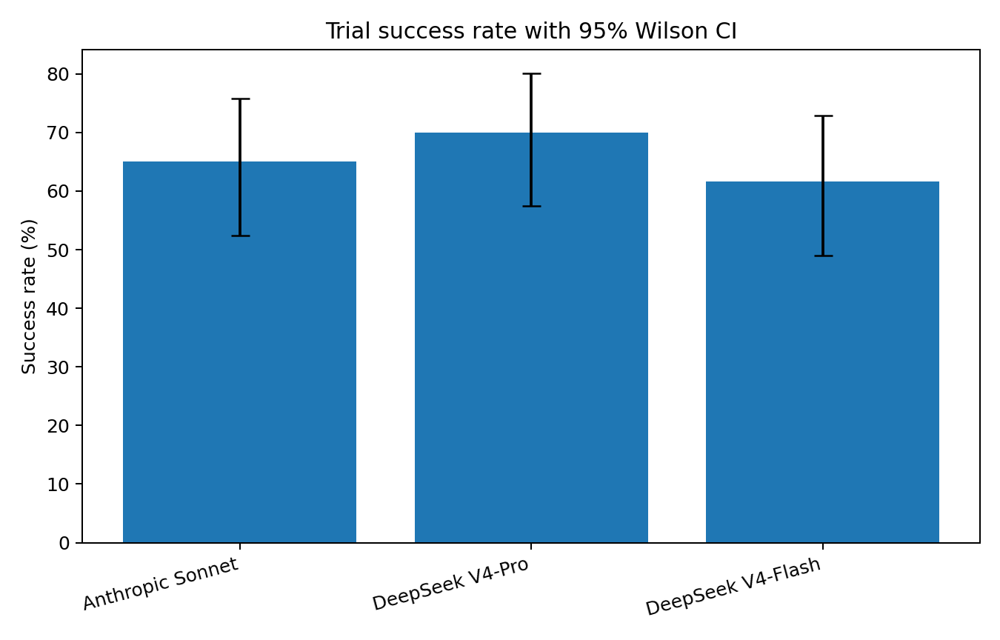
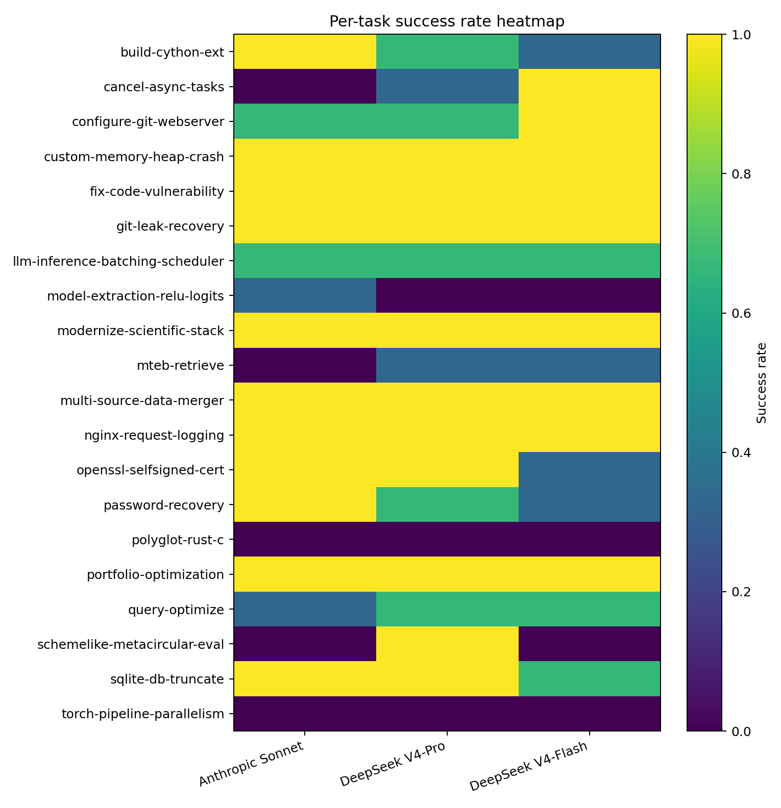
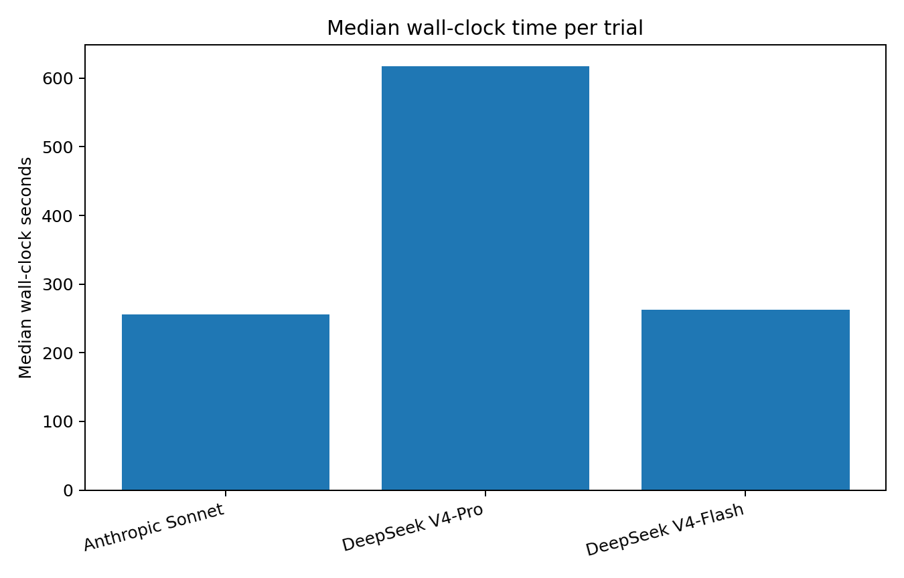
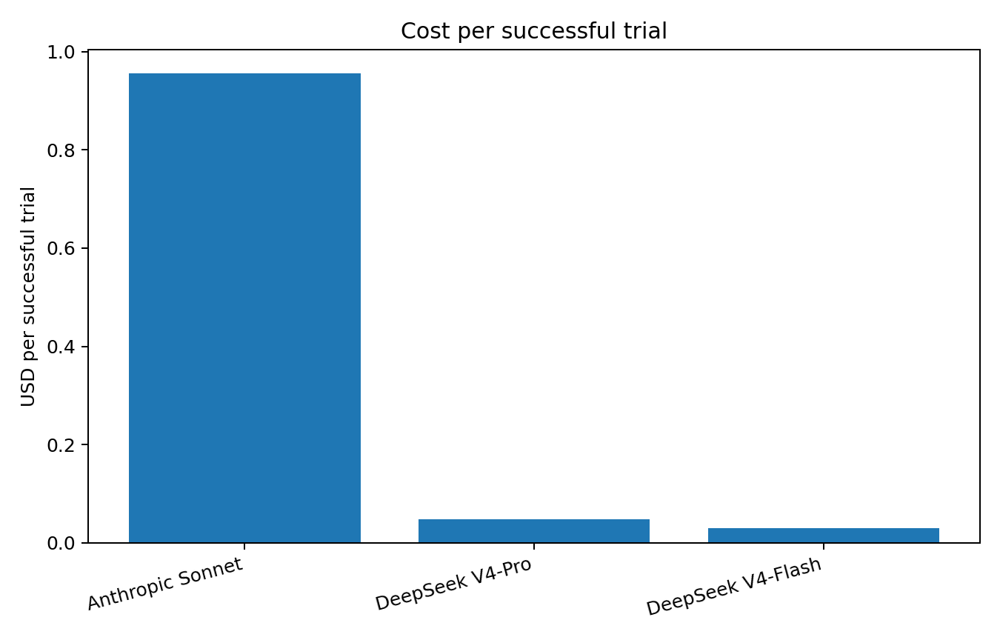
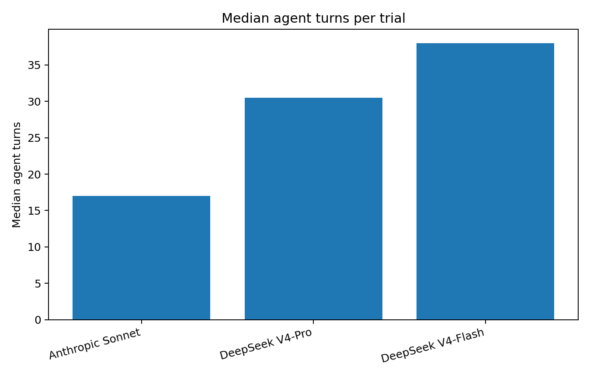
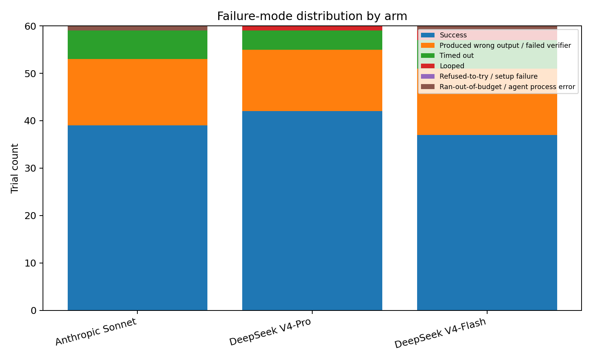

# Benchmarking Claude Code Model Backends on Terminal-Bench 2.0

**Subtitle:** Anthropic Sonnet vs DeepSeek V4-Pro vs DeepSeek V4-Flash under a fixed Claude Code agent harness  
**Author:** Nick Wagner  
**Date:** May 2026  
**Repository:** `cc-deepseek-bench`

## Abstract

This study evaluates whether Claude Code can use DeepSeek model backends as lower-cost substitutes for Anthropic Claude without sacrificing task success. The experiment uses Harbor to run Claude Code on a 20-task subset of Terminal-Bench 2.0. Three arms were tested: Anthropic `claude-sonnet-4-6`, DeepSeek `deepseek-v4-pro` / `deepseek-v4-pro[1m]`, and DeepSeek `deepseek-v4-flash`. Each arm ran 3 attempts per task, producing 180 total trials.

DeepSeek V4-Pro achieved the highest raw success rate, 42/60 = 70.0%, compared with 39/60 = 65.0% for Anthropic Sonnet and 37/60 = 61.7% for DeepSeek Flash. The Wilson confidence intervals overlap, so the quality result is best interpreted as DeepSeek Pro matching Anthropic rather than conclusively beating it. DeepSeek was dramatically cheaper: $2.01 for Pro and $1.10 for Flash versus $37.30 for Anthropic. The speed hypothesis did not hold for Pro: its median wall-clock time was 617.5 seconds versus 255.7 seconds for Anthropic. Flash was roughly speed-competitive with Anthropic at 262.7 seconds median wall-clock.

## 1. Executive summary

The hypothesis under test had three parts: quality should not meaningfully diminish, wall-clock time should drop materially, and cost per resolved task should drop even more. The results split those claims:

- **Quality:** Partly supported. DeepSeek V4-Pro matched or slightly exceeded Anthropic Sonnet in raw success rate, but not by a statistically decisive margin.
- **Speed:** Not supported for DeepSeek V4-Pro. Pro was much slower in median wall-clock and agent-execution time. Flash was approximately speed-competitive with Anthropic.
- **Cost:** Strongly supported. DeepSeek Pro and Flash were dramatically cheaper in total spend, cost per successful trial, and cost per task solved at least once.
- **Agent behavior:** The new aggregate captures Section 6.4 metrics: agent turns, tool calls, Bash calls, edit/write calls, read/search calls, repeated commands, and assignment-style failure modes.
- **Qualitative result:** The model swap did not break globally. Differences were task-specific: Pro was strongest on sustained symbolic implementation, Flash was surprisingly strong on compact async repair, and Anthropic was more reliable on exhaustive compatibility and exact-output tasks.

## 2. Assignment alignment and repository state

The authoritative assignment asks for a public repository containing a working setup, raw benchmark outputs, an aggregate analysis document, reproducibility instructions, and a short findings writeup. The current repo now contains:

```text
cc-deepseek-bench/
  ASSIGNMENT.md
  README.md
  pyproject.toml
  uv.lock
  tasks.txt
  .env.example
  .gitignore
  .export-ignore
  scripts/
    run-arm-a.sh
    run-arm-b.sh
    run-arm-c.sh
    run-oracle-subset.sh
    aggregate.py
  results/
    arm-a-anthropic/
    arm-b-deepseek-pro/
    arm-c-deepseek-flash/
    combined.csv
    combined.pre-agent-metrics.csv
  docs/
    GLOSSARY.md
    QUALITATIVE_TRANSCRIPT_REVIEW.md
    REPORT.md
    TASK_SELECTION.md
  figures/
    success_rate.png
    median_wall_clock.png
    cost_success.png
    success_heatmap.png
  analysis.md
  FINDINGS.md
  summary_metrics.csv
  agent_turns_tool_calls.csv
  failure_modes.csv
```

`combined.csv` is now the new 45-column aggregate. `combined.pre-agent-metrics.csv` is the old 36-column backup and should not be used for final charts or tables. The final raw arm outputs are present under `results/arm-a-anthropic`, `results/arm-b-deepseek-pro`, and `results/arm-c-deepseek-flash`.

## 3. Environment and reproducibility

### 3.1 Environment used

The local environment recorded during the project was:

- Node.js: v24.14.0
- npm: 11.14.1
- Claude Code: 2.1.140 in the README; some final DeepSeek trial metadata shows 2.1.141 after a minor local update during the run
- Docker: 29.4.3
- Docker Compose: v5.1.3
- uv: 0.10.11
- Python via uv/Conda: 3.13.12
- Harbor: 0.6.6
- Dataset: `terminal-bench@2.0`

For exact replication, pin Claude Code explicitly:

```bash
npm install -g @anthropic-ai/claude-code@2.1.140
# or, if matching the final DeepSeek run metadata exactly:
npm install -g @anthropic-ai/claude-code@2.1.141
```

The minor Claude Code version drift is disclosed here. It is not ideal, but it does not invalidate the assignment because the raw result metadata is committed and the main goal is an applied benchmark study rather than leaderboard submission.

### 3.2 Secret handling

The assignment examples use `.env`. This repo used ignored provider-specific secret files instead:

```bash
mkdir -p .secrets
printf 'ANTHROPIC_API_KEY=sk-ant-...
' > .secrets/anthropic.env
printf 'DEEPSEEK_API_KEY=sk-...
' > .secrets/deepseek.env
```

That deviation was intentional. During smoke testing, mixed provider environment variables could cause unintended Anthropic routing. The final scripts pass credentials explicitly into Harbor's agent environment.

### 3.3 Reproduction commands

```bash
# Oracle sanity check on the selected 20 tasks
N_ATTEMPTS=1 N_CONCURRENT=2 ./scripts/run-oracle-subset.sh

# Paid benchmark arms
N_ATTEMPTS=3 N_CONCURRENT=4 ./scripts/run-arm-a.sh
N_ATTEMPTS=3 N_CONCURRENT=4 ./scripts/run-arm-b.sh
N_ATTEMPTS=3 N_CONCURRENT=4 ./scripts/run-arm-c.sh

# Aggregate raw Harbor outputs
uv run python scripts/aggregate.py
```

Expected aggregate shape:

```text
60 rows per arm
180 rows total
45 columns in the current aggregate
```

### 3.4 CSV validation

The supplemental CSVs were regenerated from the new `results/combined.csv`. Validation against the current combined file:

| Supplemental file | Status against current `combined.csv` |
|---|---|
| `summary_metrics.csv` | matches recomputed summary metrics |
| `agent_turns_tool_calls.csv` | matches recomputed agent/tool metrics |
| `failure_modes.csv` | matches recomputed failure-mode metrics |

The backup file `results/combined.pre-agent-metrics.csv` is retained only for provenance. It lacks the Section 6.4 columns and should not be used in the final report.

## 4. Experimental design

### 4.1 Arms

| Arm | Backend | Model | Endpoint |
|---|---|---|---|
| A | Anthropic | `claude-sonnet-4-6` | default Anthropic |
| B | DeepSeek | `deepseek-v4-pro` / `deepseek-v4-pro[1m]` | `https://api.deepseek.com/anthropic` |
| C | DeepSeek | `deepseek-v4-flash` | `https://api.deepseek.com/anthropic` |

The Harbor command still uses `--model anthropic/claude-sonnet-4-6` as the Claude Code agent display/config model. For DeepSeek arms, the actual backend is selected through Claude Code's Anthropic-compatible environment variables. That detail is important because otherwise Harbor's display name can make a DeepSeek run look like an Anthropic run.

### 4.2 Task subset and oracle validation

The benchmark uses a manually stratified 20-task subset covering software engineering, system administration, data/scientific Python, database/query optimization, security, ML systems, and recovery. The original candidate `rstan-to-pystan` was removed after the oracle scored it 0/1 in the local environment. It was replaced with `model-extraction-relu-logits`, which passed a one-task oracle check. The final 20-task oracle sanity run passed 20/20.

### 4.3 Trials and nondeterminism

Each `(arm, task)` pair ran three attempts. That is important because coding agents are nondeterministic. The final design therefore produced:

```text
20 tasks x 3 attempts x 3 arms = 180 trials
```

## 5. Metrics and aggregation

The assignment's Section 6.4 requires per-run capture of success, duration, token counts, cost, number of agent turns/tool calls, and failure mode. The new `aggregate.py` captures:

```text
success
wall_clock_seconds
n_input_tokens
n_cache_tokens
n_output_tokens
effective_cost_usd
agent_turns
tool_calls
bash_calls
edit_write_calls
read_search_calls
unique_tool_count
repeated_bash_commands
tool_counts_json
failure_mode
```

Failure modes are categorized into:

```text
success
produced-wrong-output
timed-out
looped
refused-to-try
ran-out-of-budget
```

The categorization is partly rule-based from exception metadata and transcript/tool traces. It should be treated as an applied research label rather than a perfect human annotation.

### 5.1 Cost accounting rule

Anthropic costs use `provider_reported_cost_usd`, which matched the Anthropic-side confirmation for smoke testing. DeepSeek costs use `computed_cache_aware_cost_usd` as `effective_cost_usd`, because DeepSeek platform usage matched the cache-aware calculation and not Claude Code's compatibility-layer provider-reported estimate.

## 6. Quantitative results

### 6.1 Overall quality, cost, and speed



**Quality summary**

| Arm               | Model                                 |   Successes |   Trials |   Success % |   CI low % |   CI high % |
|:------------------|:--------------------------------------|------------:|---------:|------------:|-----------:|------------:|
| Anthropic Sonnet  | claude-sonnet-4-6                     |          39 |       60 |       65    |      52.36 |       75.83 |
| DeepSeek V4-Pro   | deepseek-v4-pro / deepseek-v4-pro[1m] |          42 |       60 |       70    |      57.49 |       80.1  |
| DeepSeek V4-Flash | deepseek-v4-flash                     |          37 |       60 |       61.67 |      49.02 |       72.91 |

**Cost summary**

| Arm               |   Total cost $ |   Cost / successful trial $ |   Tasks solved >=1 |   Cost / resolved task $ |
|:------------------|---------------:|----------------------------:|-------------------:|-------------------------:|
| Anthropic Sonnet  |        37.2955 |                      0.9563 |                 15 |                   2.4864 |
| DeepSeek V4-Pro   |         2.0104 |                      0.0479 |                 17 |                   0.1183 |
| DeepSeek V4-Flash |         1.103  |                      0.0298 |                 16 |                   0.0689 |

**Speed and agent-loop summary**

| Arm               |   Median wall s |   Mean wall s |   Median agent exec s |   Median agent turns |   Median tool calls |
|:------------------|----------------:|--------------:|----------------------:|---------------------:|--------------------:|
| Anthropic Sonnet  |          255.67 |        529.07 |                159.3  |                 17   |                10.5 |
| DeepSeek V4-Pro   |          617.47 |        638.47 |                387.48 |                 30.5 |                13.5 |
| DeepSeek V4-Flash |          262.66 |        503.42 |                124.02 |                 38   |                18   |

Interpretation:

- DeepSeek V4-Pro had the highest raw success rate: 42/60 = 70.0%.
- Anthropic Sonnet solved 39/60 = 65.0%.
- DeepSeek V4-Flash solved 37/60 = 61.7%.
- The Wilson intervals overlap, so the correct claim is that DeepSeek Pro matched Anthropic on this subset, not that it is conclusively superior.

### 6.2 Per-task success



| Task                             |   Anthropic Sonnet |   DeepSeek V4-Pro |   DeepSeek V4-Flash |
|:---------------------------------|-------------------:|------------------:|--------------------:|
| build-cython-ext                 |              100   |              66.7 |                33.3 |
| cancel-async-tasks               |                0   |              33.3 |               100   |
| configure-git-webserver          |               66.7 |              66.7 |               100   |
| custom-memory-heap-crash         |              100   |             100   |               100   |
| fix-code-vulnerability           |              100   |             100   |               100   |
| git-leak-recovery                |              100   |             100   |               100   |
| llm-inference-batching-scheduler |               66.7 |              66.7 |                66.7 |
| model-extraction-relu-logits     |               33.3 |               0   |                 0   |
| modernize-scientific-stack       |              100   |             100   |               100   |
| mteb-retrieve                    |                0   |              33.3 |                33.3 |
| multi-source-data-merger         |              100   |             100   |               100   |
| nginx-request-logging            |              100   |             100   |               100   |
| openssl-selfsigned-cert          |              100   |             100   |                33.3 |
| password-recovery                |              100   |              66.7 |                33.3 |
| polyglot-rust-c                  |                0   |               0   |                 0   |
| portfolio-optimization           |              100   |             100   |               100   |
| query-optimize                   |               33.3 |              66.7 |                66.7 |
| schemelike-metacircular-eval     |                0   |             100   |                 0   |
| sqlite-db-truncate               |              100   |             100   |                66.7 |
| torch-pipeline-parallelism       |                0   |               0   |                 0   |

### 6.3 Divergent tasks

Tasks with at least a two-attempt gap between arms are the best qualitative-review targets.

| Task                         |   Anthropic Sonnet |   DeepSeek V4-Pro |   DeepSeek V4-Flash |   Range |
|:-----------------------------|-------------------:|------------------:|--------------------:|--------:|
| cancel-async-tasks           |                  0 |              33.3 |               100   |   100   |
| schemelike-metacircular-eval |                  0 |             100   |                 0   |   100   |
| build-cython-ext             |                100 |              66.7 |                33.3 |    66.7 |
| openssl-selfsigned-cert      |                100 |             100   |                33.3 |    66.7 |
| password-recovery            |                100 |              66.7 |                33.3 |    66.7 |

### 6.4 Speed



Median wall-clock:

- Anthropic Sonnet: 255.7s
- DeepSeek V4-Pro: 617.5s
- DeepSeek V4-Flash: 262.7s

Median agent execution:

- Anthropic Sonnet: 159.3s
- DeepSeek V4-Pro: 387.5s
- DeepSeek V4-Flash: 124.0s

DeepSeek Pro's slowdown is therefore not mostly Docker setup or verifier overhead; it occurs inside the actual agent/model execution loop.

#### Success/failure speed split

| Arm               | Outcome   |   Trials |   Median seconds |   Mean seconds |   Total cost $ |
|:------------------|:----------|---------:|-----------------:|---------------:|---------------:|
| Anthropic Sonnet  | Failed    |       21 |          813.24  |        914.23  |         16.855 |
| Anthropic Sonnet  | Succeeded |       39 |          171.094 |        321.67  |         20.441 |
| DeepSeek V4-Pro   | Failed    |       18 |          796.792 |        745.725 |          0.568 |
| DeepSeek V4-Pro   | Succeeded |       42 |          362.531 |        592.506 |          1.442 |
| DeepSeek V4-Flash | Failed    |       23 |          655.251 |        814.041 |          0.608 |
| DeepSeek V4-Flash | Succeeded |       37 |          149.694 |        310.33  |          0.495 |

Failed runs are slower in all arms, which is expected: failures often reach verifier problems late, loop, or run into budget.

### 6.5 Cost




DeepSeek's cost advantage is the strongest result:

- Pro total arm cost: $2.01 versus $37.30 for Anthropic.
- Flash total arm cost: $1.10 versus $37.30 for Anthropic.
- Pro cost per successful trial: $0.048 versus $0.956 for Anthropic.
- Flash cost per successful trial: $0.030 versus $0.956 for Anthropic.

### 6.6 Agent turns and tool calls



| Arm               |   Median agent turns |   Median tool calls |   Mean agent turns |   Mean tool calls |
|:------------------|---------------------:|--------------------:|-------------------:|------------------:|
| Anthropic Sonnet  |                 17   |                10.5 |             28.25  |            16.85  |
| DeepSeek V4-Pro   |                 30.5 |                13.5 |             50.367 |            24.783 |
| DeepSeek V4-Flash |                 38   |                18   |             51.783 |            25.633 |

DeepSeek Pro used more turns and tool calls than Anthropic. Flash used even more median turns/tool calls but remained near Anthropic speed, suggesting that Flash has lower per-turn latency and/or lower per-turn overhead than Pro.

### 6.7 Failure modes



| Arm               |   Success |   Produced wrong output / failed verifier |   Timed out |   Looped |   Refused-to-try / setup failure |   Ran-out-of-budget / agent process error |
|:------------------|----------:|------------------------------------------:|------------:|---------:|---------------------------------:|------------------------------------------:|
| Anthropic Sonnet  |        39 |                                        14 |           6 |        0 |                                0 |                                         1 |
| DeepSeek V4-Pro   |        42 |                                        13 |           4 |        1 |                                0 |                                         0 |
| DeepSeek V4-Flash |        37 |                                        14 |           6 |        2 |                                0 |                                         1 |

Most failures were `produced-wrong-output` or `timed-out`. There is no strong evidence of widespread refused-to-try behavior or systematic Anthropic-format tool-use incompatibility. The failures were mostly normal coding-agent failures.

## 7. DeepSeek Anthropic-compatible API edge cases

The final runs do not show a broad Anthropic API format break. DeepSeek ran through Claude Code using the Anthropic-compatible endpoint. The main operational issues were setup and accounting issues rather than malformed tool calls:

1. **Environment propagation:** Early smoke tests showed that DeepSeek routing could silently fall back to the Anthropic credential path if environment variables were not explicitly passed into Harbor's agent process.
2. **Display-name confusion:** Harbor/Claude Code can still display `anthropic/claude-sonnet-4-6` as the configured model even when the actual backend is DeepSeek through environment override. The final scripts and report document this.
3. **Cost-reporting mismatch:** Claude Code's compatibility-layer `provider_reported_cost_usd` was misleading for DeepSeek. DeepSeek platform billing matched the cache-aware computed cost.
4. **No systemic tool-call break:** The final aggregate shows normal tool traces, Bash calls, Read/Edit calls, and verifier failures. Failures appear task/model-specific, not evidence that DeepSeek could not speak the Anthropic tool-use format.

## 8. Qualitative transcript review of divergent tasks

### 8.1 `schemelike-metacircular-eval`: DeepSeek Pro advantage on symbolic/interpreter work

Outcome: Anthropic 0/3, DeepSeek Pro 3/3, Flash 0/3.

This was the strongest DeepSeek Pro-positive divergence. The task required writing `eval.scm`, a metacircular evaluator for the Scheme-like language implemented by `interp.py`. The successful Pro transcripts show that Pro read the interpreter and test programs, wrote `/app/eval.scm`, repeatedly tested it using `interp.py`, and patched the evaluator until the self-interpretation behavior matched. One Pro run used 42 Bash calls and multiple edits to `eval.scm`; another used 49 Bash calls and iterative comparisons against test programs.

The Anthropic and Flash failures looked different. One Anthropic run read files but then hit an output-token failure before writing a solution. Two Anthropic runs timed out. Flash showed the same pattern: reading and planning without producing a working evaluator, followed by timeouts or output-limit failure. This looks less like an Anthropic API-format mismatch and more like a task/model dynamic: the task demands sustained symbolic implementation and repeated testing. Pro was willing and able to iterate through that loop; Anthropic and Flash did not complete it under the timeout.

Hedge-fund workflow alignment: low to medium. Most hedge-fund workflows do not require metacircular Scheme interpreters. However, the task is relevant by analogy to DSLs, strategy-expression evaluators, query planners, custom rule engines, and internal research languages.

### 8.2 `cancel-async-tasks`: Flash advantage on compact async control-flow debugging

Outcome: Anthropic 0/3, DeepSeek Pro 1/3, Flash 3/3.

This task asked for an async `run_tasks` implementation that limits concurrency and handles keyboard interrupts so cleanup code still runs. Anthropic wrote a conventional `asyncio.Semaphore` plus `gather` solution. The verifier failure showed the classic gotcha: queued tasks above `max_concurrent` were still created, and cancellation behavior did not prevent queued tasks from starting or did not drain cleanup correctly.

Flash's successful run wrote a more operationally correct signal-aware implementation: it tracked a `running` set, installed signal handlers, used a `stop_event`, cancelled running tasks, avoided launching additional queued work after interruption, and drained cancelled tasks to allow cleanup. It also ran local tests. This is a good example where the smaller/faster model was not merely cheaper; it found a simpler correct pattern.

Hedge-fund workflow alignment: high. Async cancellation and bounded concurrency map directly to market-data ingestion, websocket consumers, order-routing services, streaming analytics, and batch job orchestration.

### 8.3 `build-cython-ext`: Anthropic advantage on exhaustive scientific-stack compatibility

Outcome: Anthropic 3/3, DeepSeek Pro 2/3, Flash 1/3.

The task required cloning and building `pyknotid` with Cython extensions under Python 3.13 and NumPy 2.x. The failure mode is very informative. DeepSeek Pro and Flash both handled much of the obvious migration: `fractions.gcd` to `math.gcd`, deprecated `np.float`, `np.int`, and `np.bool` aliases, building extensions, and running visible tests. But the failing runs missed a remaining Cython path in `ccomplexity`: the verifier failed at `cc.cython_higher_order_writhe(points, contributions, order)`, indicating a remaining NumPy alias or compiled-extension compatibility problem.

Anthropic's successful run appears to have performed a broader compatibility sweep across more files and did not stop at the happy-path example. This suggests a pattern: Anthropic was more exhaustive on dependency-migration work, while DeepSeek sometimes declared success after visible tests or after fixing the most obvious migration paths.

Hedge-fund workflow alignment: high. Quant and data teams frequently rely on compiled scientific Python, Cython/Numba/C++ extensions, and fragile NumPy/SciPy compatibility surfaces.

### 8.4 `query-optimize`: DeepSeek advantage on SQL rewrite/search strategy

Outcome: Anthropic 1/3, DeepSeek Pro 2/3, Flash 2/3.

This task required writing an optimized SQL query. Anthropic produced a plausible CTE/window-function rewrite but failed the runtime comparison in two attempts. A successful Pro run explicitly inspected the schema, used query-plan analysis, materialized word-level stats and sense counts, and removed repeated correlated subqueries. The final explanation correctly identified correlated scalar subqueries as the core performance problem.

This looks like a domain-specific reasoning advantage for the DeepSeek arms on this task family: they were more likely to target the cost driver rather than only rewrite the query into a cleaner but still insufficient form.

Hedge-fund workflow alignment: high. Query optimization is directly relevant to research databases, backtest stores, feature stores, tick/quote archives, metadata catalogs, and reporting systems.

### 8.5 `openssl-selfsigned-cert`: Flash dependency-assumption failure

Outcome: Anthropic 3/3, DeepSeek Pro 3/3, Flash 1/3.

The Flash failure inspected here generated the certificate artifacts but wrote a Python verification script that imported `cryptography`, which was not installed in the container. The verifier failed with `ModuleNotFoundError: No module named 'cryptography'`. That is a concrete failure type: the model assumed a dependency rather than constraining itself to the available runtime or using the standard library/openssl CLI.

This does not look like a DeepSeek Anthropic-format issue. It is a model/tooling failure: insufficient environment awareness and insufficient local verification under the actual dependency set.

Hedge-fund workflow alignment: medium to high. Certificate and internal TLS work is DevOps/security infrastructure, relevant to internal APIs and data services, though not alpha research itself.

### 8.6 `password-recovery`: Anthropic advantage on forensic exactness

Outcome: Anthropic 3/3, DeepSeek Pro 2/3, Flash 1/3.

Flash's inspected failure found a partial password and wrote `PASSWORD=8XDP5Q2RT9ZW54` to `/app/recovered_passwords.txt`, but the verifier expected the raw password `8XDP5Q2RT9ZK7VB3BV4WW54`. The failure combined two issues: including the `PASSWORD=` prefix and failing to reconstruct the missing middle segment. One DeepSeek Pro attempt timed out without producing the file; two Pro attempts succeeded.

This task rewards forensic search persistence and exact output formatting. Anthropic was more reliable. Flash's failure is a good example of a model producing a plausible-looking recovered value and final explanation while missing a hidden exact-match requirement.

Hedge-fund workflow alignment: medium. It is relevant to incident response, credential recovery, disk forensics, and security operations, but less representative of day-to-day quant engineering.

### 8.7 Hard tasks where all arms struggled

`polyglot-rust-c` and `torch-pipeline-parallelism` were 0/3 across all arms. These are not good model-differentiation examples in this run. They indicate benchmark hardness or harness/task mismatch more than provider-specific weakness.

`torch-pipeline-parallelism` is still hedge-fund relevant for ML infrastructure, but the specific task is specialized. `polyglot-rust-c` is lower relevance: it is an interesting compiler/polyglot puzzle, but uncommon in production fund workflows.

## 9. Patterns from the qualitative review

1. **DeepSeek Pro is best on sustained abstract implementation.** The clearest example is `schemelike-metacircular-eval`, where Pro solved all attempts and both other arms failed.
2. **Flash can be surprisingly strong on compact fixes.** `cancel-async-tasks` was the clearest example: Flash solved 3/3 with a clean signal/cancellation-aware design.
3. **Anthropic is stronger on exhaustive compatibility and exactness.** `build-cython-ext`, `password-recovery`, and `openssl-selfsigned-cert` show cases where Anthropic or Pro avoided narrow happy-path fixes better than Flash.
4. **Data engineering and security tasks were among the most hedge-fund-relevant.** The most representative tasks were `query-optimize`, `multi-source-data-merger`, `build-cython-ext`, `modernize-scientific-stack`, `portfolio-optimization`, `llm-inference-batching-scheduler`, `fix-code-vulnerability`, and `git-leak-recovery`.
5. **Cheap does not mean fast.** DeepSeek Pro was cheap and high quality, but slower in agent execution. Flash was cheap and near Anthropic speed.

## 10. Hedge-fund workflow alignment

The benchmark was not hedge-fund-specific, but several tasks map closely to realistic fund engineering workflows.

### High alignment

- `query-optimize`: research databases, backtest stores, feature stores, tick/quote archives, metadata catalogs.
- `multi-source-data-merger`: alternative data ingestion, vendor normalization, data-quality pipelines.
- `portfolio-optimization`: direct quant/research relevance.
- `modernize-scientific-stack`: maintaining quant Python and numerical packages.
- `build-cython-ext`: compiled scientific Python and NumPy/SciPy/Cython compatibility.
- `llm-inference-batching-scheduler`: internal AI inference services and batched agent backends.
- `fix-code-vulnerability`: secure internal software and code review.
- `git-leak-recovery`: secret hygiene and incident response.

### Medium alignment

- `cancel-async-tasks`: streaming ingestion, websocket consumers, order-routing services, async job orchestration.
- `openssl-selfsigned-cert`: internal TLS, API certificates, and platform engineering.
- `password-recovery`: incident response and security operations.
- `mteb-retrieve`: retrieval/evaluation workflows for internal search and RAG systems.

### Lower alignment

- `schemelike-metacircular-eval`: low direct relevance, but useful analogically for DSLs, rule engines, and strategy-expression evaluators.
- `polyglot-rust-c`: interesting systems puzzle, less representative of normal fund workflows.
- `torch-pipeline-parallelism`: relevant to ML infra but specialized.

## 11. Related benchmark context

Terminal-Bench is a good fit for this assignment because it evaluates agents in terminal environments with deterministic containerized tests. SWE-bench Verified is important industry context, but it primarily evaluates GitHub issue resolution and does not isolate the Claude Code harness with backend substitution in the same way. This study's contribution is narrower: hold Claude Code fixed and vary the model endpoint.

The result also reinforces a lesson common in agent benchmarking: model quality, cost, and end-to-end latency do not move together. Cheap tokens do not automatically imply fast agent execution, because the agent loop may take more turns, use more tools, or run longer debugging trajectories.

## 12. Threats to validity

1. The task subset has 20 tasks, not the full Terminal-Bench 2.0 benchmark.
2. Each cell has only 3 attempts, enough for rough nondeterminism control but not fine-grained statistical certainty.
3. The run used one local machine and one Harbor/Claude Code configuration.
4. Timeout behavior depends on default task and agent time limits.
5. DeepSeek prices and discounts may change.
6. DeepSeek routing used the Anthropic-compatible endpoint; results may differ with native DeepSeek clients or other adapters.
7. Failure-mode labels are rule-assisted and should be interpreted as useful diagnostics, not perfect human annotations.
8. Claude Code minor version drift should be disclosed.

## 13. Section 10 extra-credit status

The assignment's Section 10 suggests optional extra credit such as a SWE-bench subset, routing policy, or deeper transcript study. This repo does not run SWE-bench. It does, however, partially addresses the routing-policy angle in the production recommendation and includes a targeted transcript review. SWE-bench should be described as future work, not as completed work.

## 14. Production recommendation

Do not treat DeepSeek as a drop-in universal replacement. Treat each backend as a different operating point:

- Use **DeepSeek V4-Pro** when cost matters and latency is acceptable. It matched Anthropic quality in this subset but was slower.
- Use **DeepSeek V4-Flash** for cheap first-pass attempts, broad exploration, and compact fixes where near-Anthropic speed is helpful.
- Keep **Anthropic Sonnet** for latency-sensitive work and task classes where it remains more reliable, especially exhaustive compatibility and exact-output tasks.

The most promising follow-up is a cost-aware router: try Flash first, escalate to Pro for reasoning-heavy tasks or Flash failures, and reserve Anthropic for latency-sensitive or historically Anthropic-favored task classes.

## 15. Submission checklist

Before final submission:

- Confirm `results/combined.csv` is committed and generated by the new `aggregate.py`.
- Commit raw Harbor outputs for the three final arms.
- Commit `summary_metrics.csv`, `agent_turns_tool_calls.csv`, and `failure_modes.csv` regenerated from the new combined file.
- Commit `analysis.md`, `FINDINGS.md`, `docs/REPORT.md`, `docs/REPORT.pdf`, `docs/QUALITATIVE_TRANSCRIPT_REVIEW.md`, `docs/GLOSSARY.md`, and figures.
- Run a final secret scan excluding `.secrets/`, `.env`, `.venv`, `.git`, and lock files.
- Mention the Claude Code version drift in README/report.
- Do not claim SWE-bench extra credit was performed.

## References

- Terminal-Bench / Harbor project and Terminal-Bench 2.0 documentation.
- SWE-bench and SWE-bench Verified as related benchmark context.
- DeepSeek Anthropic-compatible endpoint and context-caching documentation.
- Anthropic Claude Code documentation and model/pricing documentation.
