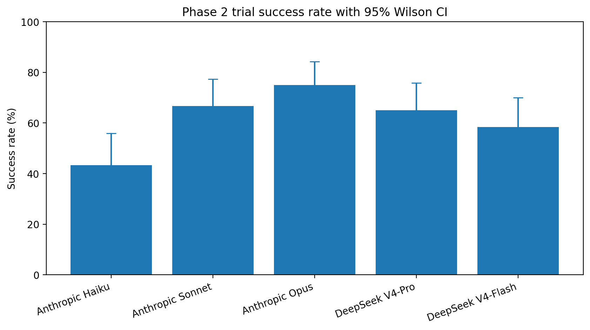
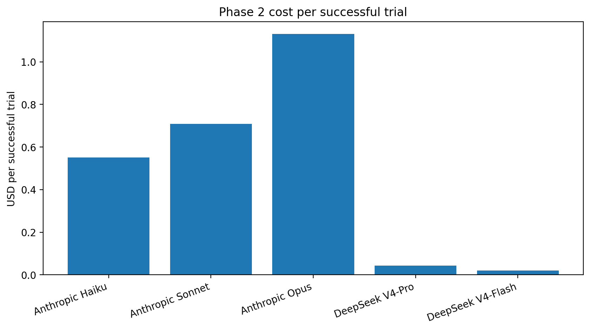
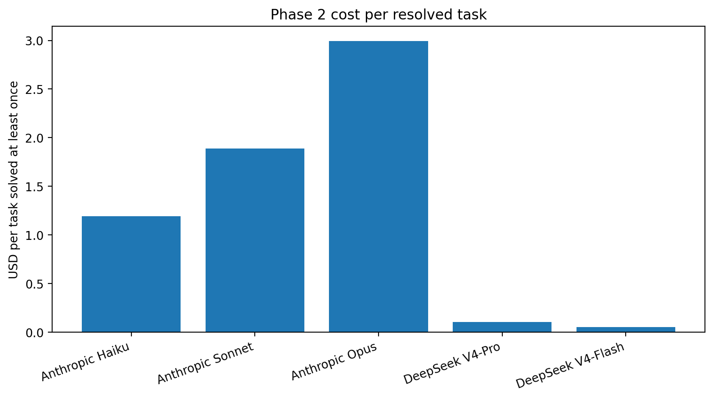
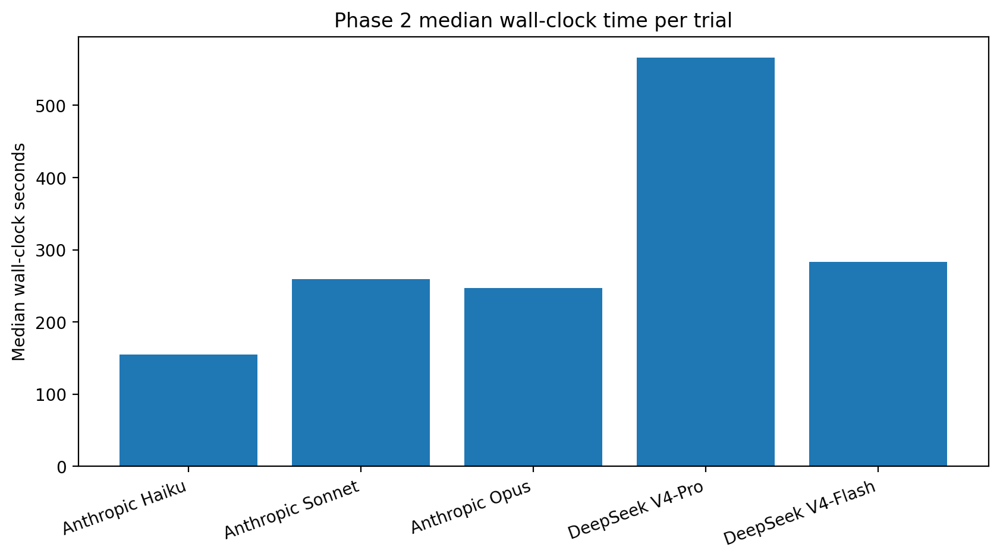
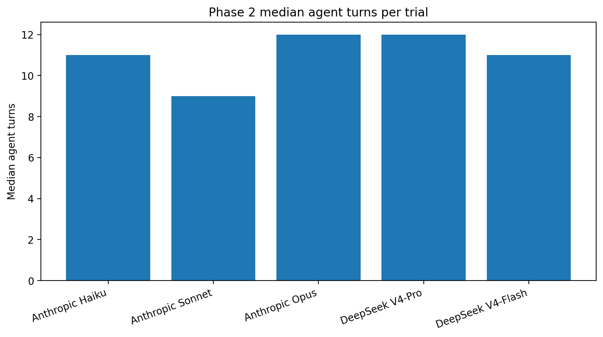
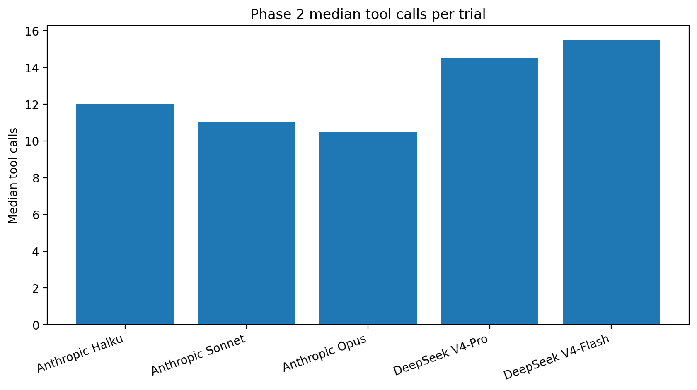
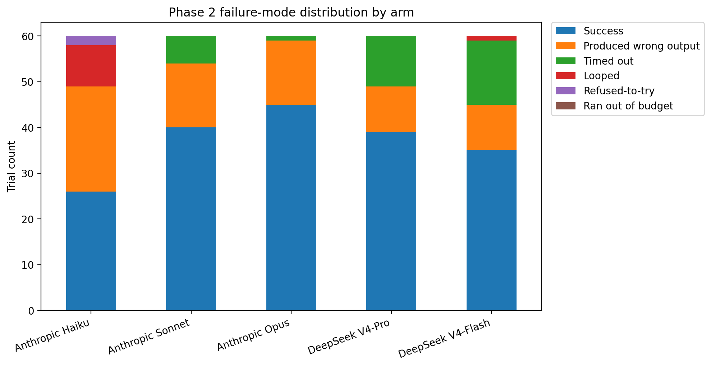
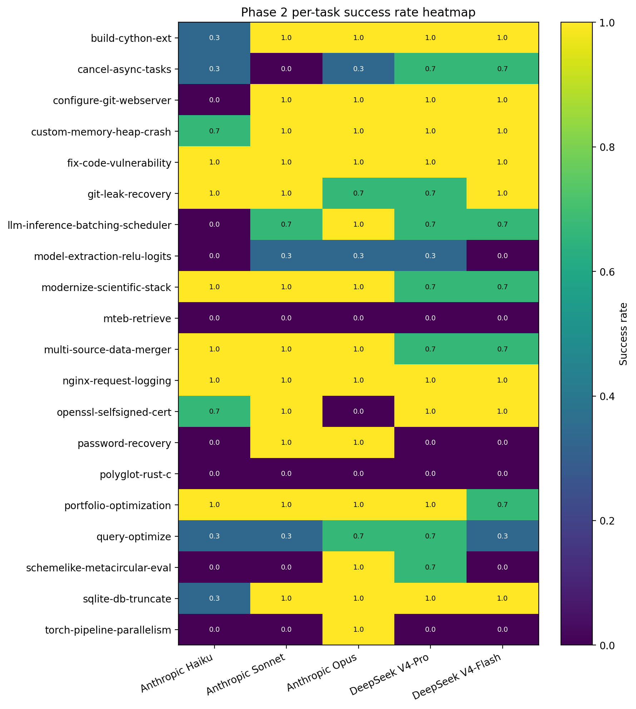

# Claude Code Backend Benchmark - Phase 2 Report

**Benchmarking expanded Claude Code model backends on Terminal-Bench 2.0**  
**Subtitle:** Anthropic Haiku, Sonnet, and Opus vs DeepSeek V4-Pro and DeepSeek V4-Flash under a fixed Claude Code agent harness  
**Author:** Nick Wagner  
**Date:** May 2026  
**Repository:** `cc-deepseek-bench`  
**Branch:** `cc-agent-model-branch`

## Abstract

Phase 2 extends the Phase 1 Claude Code backend benchmark from a three-arm Anthropic-vs-DeepSeek comparison into a broader model/backend matrix. The experiment keeps the same Claude Code agent harness, the same selected 20 Terminal-Bench 2.0 tasks, and the same three-attempt-per-task design, but expands the scored arms to Anthropic Haiku, Anthropic Sonnet, Anthropic Opus, DeepSeek V4-Pro, and DeepSeek V4-Flash. The scored Phase 2 sweep therefore contains 20 tasks x 3 attempts x 5 arms = 300 trials.

The strongest Phase 2 arm by raw success rate was Anthropic Opus, with 45/60 successful trials = 75.0%. Anthropic Sonnet followed at 40/60 = 66.7%. DeepSeek V4-Pro was close to Sonnet at 39/60 = 65.0%, while costing dramatically less, but it was the slowest arm by median wall-clock time. DeepSeek V4-Flash reached 35/60 = 58.3% at extremely low cost. Anthropic Haiku reached 26/60 = 43.3%; it was the fastest median wall-clock arm, but the lower success rate makes it less attractive for difficult terminal-engineering tasks.

Phase 2 also investigated Claude Code default model selection and the `opusplan` alias as smoke/canary findings. The default/no-`--model` path resolved to `claude-opus-4-7[1m]` in this account environment, while the `opusplan` canary accepted the alias but showed Sonnet-only execution and no visible true Plan Mode cycle. Those findings are important for future work but are not part of the 300-trial scored Phase 2 matrix.

## 1. Executive Summary

Phase 2 asks what happens when the Claude Code agent harness is held fixed while the model/backend matrix is expanded. Phase 1 established that DeepSeek V4-Pro could match Anthropic Sonnet quality on the selected Terminal-Bench subset at much lower cost but with much slower execution. Phase 2 adds a broader capability ladder: Haiku, Sonnet, Opus, DeepSeek Pro, and DeepSeek Flash.

The headline result is that Opus produced the best raw success rate in the Phase 2 sweep, while DeepSeek Pro remained close to Sonnet quality at a tiny fraction of the cost. The result is not a universal model ranking. It is an applied benchmark of these models as backends inside the Claude Code terminal-agent loop on a fixed 20-task subset.

Key findings:

- **Quality:** Anthropic Opus led the Phase 2 scored sweep at 75.0%. Sonnet reached 66.7%, DeepSeek Pro 65.0%, DeepSeek Flash 58.3%, and Haiku 43.3%.
- **Cost:** DeepSeek remained dramatically cheaper. DeepSeek Pro cost about $1.71 for the full 60-trial arm; DeepSeek Flash cost about $0.72. Opus cost about $50.93 and Sonnet about $28.36.
- **Speed:** Haiku had the shortest median wall-clock time, but its quality was much lower. Opus and Sonnet were similar in median wall-clock. DeepSeek Pro was much slower. DeepSeek Flash was closer to Anthropic speed.
- **Agent behavior:** DeepSeek Pro and Flash generally used more tool calls than the Anthropic arms. That should be interpreted as model-plus-harness behavior, not pure model behavior.
- **Failure modes:** Most failures were verifier failures (`produced-wrong-output`) or timeouts. The results do not show broad evidence that DeepSeek systematically failed to speak the Anthropic-compatible tool-use format.
- **Default and OpusPlan:** Default model selection and `opusplan` are useful discovery findings, but not full scored Phase 2 arms. Default resolved to `claude-opus-4-7[1m]`; `opusplan` behaved like Sonnet-only execution in the observed canary.

The practical recommendation is to treat the backends as different operating points. Use Opus when quality dominates cost, Sonnet as a balanced Anthropic control, DeepSeek Pro when cost matters and latency is acceptable, and Flash for low-cost exploratory attempts. Use Haiku cautiously on hard terminal tasks.

## 2. Relationship to Phase 1

Phase 1 was the frozen baseline. It compared three arms on the same selected 20 Terminal-Bench 2.0 tasks, with three attempts per task, for 180 total trials:

- Anthropic Sonnet / `claude-sonnet-4-6`
- DeepSeek V4-Pro through DeepSeek's Anthropic-compatible endpoint
- DeepSeek V4-Flash through DeepSeek's Anthropic-compatible endpoint

Phase 1's main finding was that DeepSeek V4-Pro matched or slightly exceeded Sonnet in raw success rate, at much lower cost, but with much slower wall-clock time. DeepSeek Flash was the cheapest and roughly speed-competitive with Sonnet, but slightly lower quality.

Phase 2 was motivated by sponsor requests to add more models, test Claude Code default/auto model selection, test Haiku, and dig deeper into why tests pass or fail. Phase 2 therefore keeps the Claude Code harness and task set fixed but expands the model/backend matrix. Phase 1 is not overwritten or replaced; it remains the baseline comparator. Phase 2's source of truth is `results/phase2/combined.csv`, while Phase 1's source of truth remains `results/combined.csv`.

## 3. Benchmark Architecture

### 3.1 Overall repository / execution architecture

```text
┌────────────────────────────────────────────────────────────────────┐
│ cc-deepseek-bench repository                                       │
│                                                                    │
│  tasks.txt                    selected 20 Terminal-Bench tasks     │
│  scripts/run-*.sh             phase-specific arm launchers         │
│  scripts/aggregate*.py        long-format aggregate generation     │
│  docs/                        reports, plans, glossary, findings  │
│  results/                     raw and aggregate benchmark outputs  │
└────────────────────────────────────────────────────────────────────┘
                                │
                                ▼
┌────────────────────────────────────────────────────────────────────┐
│ Run scripts                                                        │
│                                                                    │
│ - source ignored provider secrets                                  │
│ - set or clear Anthropic / DeepSeek routing environment variables  │
│ - build Harbor task arguments from tasks.txt                       │
│ - write outputs under results/...                                  │
└────────────────────────────────────────────────────────────────────┘
                                │
                                ▼
┌────────────────────────────────────────────────────────────────────┐
│ Harbor                                                             │
│                                                                    │
│ - benchmark runner / orchestrator                                  │
│ - loads Terminal-Bench 2.0 tasks                                   │
│ - starts isolated task environments                                │
│ - invokes Claude Code as --agent claude-code                       │
│ - controls attempts and concurrency                                │
│ - captures trial artifacts and verifier output                     │
└────────────────────────────────────────────────────────────────────┘
                                │
                                ▼
┌────────────────────────────────────────────────────────────────────┐
│ Terminal-Bench 2.0 task environment                                │
│                                                                    │
│ - realistic terminal task in a container                           │
│ - files, services, tests, hidden requirements                       │
│ - deterministic verifier                                           │
└────────────────────────────────────────────────────────────────────┘
                                │
                                ▼
┌────────────────────────────────────────────────────────────────────┐
│ Claude Code agent harness                                          │
│                                                                    │
│ - reads task prompt                                                │
│ - uses Bash / Read / Edit / Write / Grep / Glob tools              │
│ - modifies files and runs commands                                 │
│ - calls backend model on each agent turn                           │
└────────────────────────────────────────────────────────────────────┘
                                │
                                ▼
┌────────────────────────────────────────────────────────────────────┐
│ Model backend                                                      │
│                                                                    │
│ Native Anthropic path: Haiku, Sonnet, Opus                         │
│ DeepSeek path: Anthropic-compatible endpoint                       │
│ Future path: router-mediated Gemini/OpenAI/xAI experiments         │
└────────────────────────────────────────────────────────────────────┘
                                │
                                ▼
┌────────────────────────────────────────────────────────────────────┐
│ Verifier + result artifacts + aggregate reports                    │
│                                                                    │
│ result.json, agent logs, trajectory.json, verifier logs            │
│          ↓                                                         │
│ aggregate CSV                                                      │
│          ↓                                                         │
│ report / findings / qualitative review                             │
└────────────────────────────────────────────────────────────────────┘
```

Mental model:

- **Terminal-Bench** = the exam.
- **Harbor** = the proctor / runner.
- **Claude Code** = the test-taking agent harness.
- **Model backend** = the brain inside the agent.
- **Verifier** = the grader.
- **Aggregate scripts** = the scorebook and behavioral telemetry extractor.

### 3.2 Phase 1 architecture

```text
Phase 1: frozen baseline

20 tasks x 3 attempts x 3 arms = 180 trials

run-arm-a.sh
    └── Harbor
          └── Terminal-Bench 2.0
                └── Claude Code
                      └── Anthropic Sonnet / claude-sonnet-4-6
                            └── results/arm-a-anthropic/

run-arm-b.sh
    └── Harbor
          └── Terminal-Bench 2.0
                └── Claude Code
                      └── DeepSeek V4-Pro via https://api.deepseek.com/anthropic
                            └── results/arm-b-deepseek-pro/

run-arm-c.sh
    └── Harbor
          └── Terminal-Bench 2.0
                └── Claude Code
                      └── DeepSeek V4-Flash via https://api.deepseek.com/anthropic
                            └── results/arm-c-deepseek-flash/

scripts/aggregate.py
    └── results/combined.csv
```

### 3.3 Phase 2 architecture

```text
Phase 2: expanded scored model/backend matrix

20 tasks x 3 attempts x 5 arms = 300 scored trials

Native Anthropic path
─────────────────────
run-phase2-arm-anthropic-haiku.sh
    └── Claude Code + claude-haiku-4-5-20251001
          └── results/phase2/arm-anthropic-haiku/

run-phase2-arm-anthropic-sonnet.sh
    └── Claude Code + claude-sonnet-4-6
          └── results/phase2/arm-anthropic-sonnet/

run-phase2-arm-anthropic-opus.sh
    └── Claude Code + claude-opus-4-7
          └── results/phase2/arm-anthropic-opus/

DeepSeek Anthropic-compatible path
──────────────────────────────────
run-phase2-arm-deepseek-pro.sh
    └── Claude Code + DeepSeek V4-Pro through Anthropic-compatible env vars
          └── results/phase2/arm-deepseek-pro/

run-phase2-arm-deepseek-flash.sh
    └── Claude Code + DeepSeek V4-Flash through Anthropic-compatible env vars
          └── results/phase2/arm-deepseek-flash/

Smoke / canary side paths
─────────────────────────
run-phase2-arm-anthropic-default.sh
    └── no explicit --model; observed claude-opus-4-7[1m]
          └── results/phase2/smoke/arm-anthropic-default/

run-phase2-arm-anthropic-opusplan.sh
    └── --model opusplan canary; observed Sonnet-only behavior
          └── results/phase2/canary/arm-anthropic-opusplan/

scripts/aggregate_phase2.py
    └── results/phase2/combined.csv
```

### 3.4 Result artifact / telemetry pipeline

```text
Per trial directory
    │
    ├── result.json
    │     ├── task name / trial name
    │     ├── reward / success
    │     ├── timing stages
    │     ├── token counts
    │     └── exception metadata
    │
    ├── agent/claude-code.txt
    │     ├── Claude Code JSONL stream
    │     ├── observed model strings
    │     ├── tool-use events
    │     └── cost/model usage metadata
    │
    ├── agent/trajectory.json
    │     ├── agent turns
    │     └── tool trajectory where available
    │
    └── verifier/
          ├── reward.txt
          ├── ctrf.json
          └── test-stdout.txt

scripts/aggregate_phase2.py
    │
    ├── parses result JSON
    ├── extracts observed model metadata
    ├── computes effective cost
    ├── counts agent turns, tool calls, Bash calls, edit/read/search calls
    ├── applies rule-assisted failure-mode taxonomy
    └── writes results/phase2/combined.csv
```

## 4. Experimental Design

Phase 2 uses Terminal-Bench 2.0 as the task substrate and Harbor as the benchmark runner. The selected task subset is the same 20-task subset used in Phase 1 after the oracle sanity correction. Each arm ran three attempts per task.

- **Dataset:** `terminal-bench@2.0`
- **Task subset:** 20 selected tasks in `tasks.txt`
- **Attempts:** 3 attempts per task per arm
- **Scored arms:** 5
- **Total scored design:** 20 tasks x 3 attempts x 5 arms = 300 trials
- **Fixed agent harness:** Claude Code
- **Main variable:** model/backend
- **Phase 2 output root:** `results/phase2/`
- **Phase 2 aggregate source of truth:** `results/phase2/combined.csv`

| Arm | Backend | Requested model / routing | Observed model | Role |
|---|---|---|---|---|
| Anthropic Haiku | Anthropic | `claude-haiku-4-5-20251001` | `claude-haiku-4-5-20251001` | Scored Phase 2 arm |
| Anthropic Sonnet | Anthropic | `anthropic/claude-sonnet-4-6` | `claude-sonnet-4-6` | Scored Phase 2 arm and Phase 1-style control |
| Anthropic Opus | Anthropic | `opus` | `claude-opus-4-7` | Scored premium Anthropic arm |
| DeepSeek V4-Pro | DeepSeek | `ANTHROPIC_BASE_URL=https://api.deepseek.com/anthropic`, `ANTHROPIC_MODEL=deepseek-v4-pro[1m]` | `deepseek-v4-pro[1m]` where transcript metadata was available | Scored DeepSeek quality arm |
| DeepSeek V4-Flash | DeepSeek | `ANTHROPIC_BASE_URL=https://api.deepseek.com/anthropic`, `ANTHROPIC_MODEL=deepseek-v4-flash` | `deepseek-v4-flash` where transcript metadata was available | Scored DeepSeek cheap/fast arm |
| Anthropic default | Anthropic | no explicit `--model` | `claude-opus-4-7[1m]` in smoke run | Smoke/discovery only |
| Anthropic OpusPlan | Anthropic | `opusplan` | `claude-sonnet-4-6` in canary | Canary only; no visible true Plan Mode cycle |

## 5. Environment and Reproducibility

The Phase 2 branch follows the same local-first pattern as Phase 1 but writes all new scored results under `results/phase2/`.

Important files and directories:

```text
cc-deepseek-bench/
  tasks.txt                         # 20 scored tasks
  tasks.phase2-smoke.txt             # 5-task smoke subset
  tasks.phase2-canary.txt            # canary task list
  scripts/
    run-phase2-arm-anthropic-haiku.sh
    run-phase2-arm-anthropic-sonnet.sh
    run-phase2-arm-anthropic-opus.sh
    run-phase2-arm-anthropic-default.sh
    run-phase2-arm-anthropic-opusplan.sh
    run-phase2-arm-deepseek-pro.sh
    run-phase2-arm-deepseek-flash.sh
    aggregate_phase2.py
  results/
    combined.csv                     # Phase 1 frozen aggregate
    phase2/
      combined.csv                   # Phase 2 scored aggregate
      arm-anthropic-haiku/
      arm-anthropic-sonnet/
      arm-anthropic-opus/
      arm-deepseek-pro/
      arm-deepseek-flash/
      smoke/
      canary/
  docs/
    REPORT.md                        # Phase 1 report
    PHASE2_REPORT.md                 # this report
    PHASE2_PLAN.md
    MODEL_MATRIX.md
    FAILURE_ANALYSIS_PLAN.md
    PLAN_MODE_FINDINGS_AND_FUTURE_STUDY.md
    GLOSSARY.md
```

Secret handling:

```bash
mkdir -p .secrets
printf 'ANTHROPIC_API_KEY=sk-ant-...
' > .secrets/anthropic.env
printf 'DEEPSEEK_API_KEY=sk-...
' > .secrets/deepseek.env
```

`.secrets/` and `.env` must remain ignored and must not be committed.

Syntax checks:

```bash
python -m py_compile scripts/aggregate_phase2.py
bash -n scripts/run-phase2-arm-anthropic-haiku.sh
bash -n scripts/run-phase2-arm-anthropic-sonnet.sh
bash -n scripts/run-phase2-arm-anthropic-opus.sh
bash -n scripts/run-phase2-arm-deepseek-pro.sh
bash -n scripts/run-phase2-arm-deepseek-flash.sh
```

Run one Phase 2 arm:

```bash
TASK_FILE=tasks.txt N_ATTEMPTS=3 N_CONCURRENT=4   ./scripts/run-phase2-arm-anthropic-sonnet.sh
```

Rerun aggregation from existing raw outputs:

```bash
uv run python scripts/aggregate_phase2.py
```

Inspect summary:

```bash
python - <<'PY'
import pandas as pd

df = pd.read_csv('results/phase2/combined.csv')
print(df.groupby('arm_dir').agg(
    trials=('success', 'count'),
    successes=('success', 'sum'),
    success_rate=('success', 'mean'),
    total_cost=('effective_cost_usd', 'sum'),
    median_wall=('wall_clock_seconds', 'median'),
    median_turns=('agent_turns', 'median'),
    median_tools=('tool_calls', 'median'),
    median_bash=('bash_calls', 'median'),
))
PY
```

Secret scan before commit:

```bash
grep -R --line-number --binary-files=without-match   -E 'sk-ant-api[0-9]+-[A-Za-z0-9_-](40,)|sk-[A-Za-z0-9_-](32,)|DEEPSEEK_API_KEY=[^.$<][^[:space:]]+|ANTHROPIC_AUTH_TOKEN=[^$<][^[:space:]]+'   scripts docs results/phase2   --exclude-dir=.git   --exclude-dir=.venv   --exclude-dir=.secrets   --exclude='.env'   --exclude='*.lock'

git check-ignore -v .secrets/anthropic.env .secrets/deepseek.env .env
```

Rerunning full arms incurs real API cost. The aggregate CSV and raw outputs are committed so later readers can reproduce analysis without re-running the benchmark.

## 6. Metrics and Aggregation

`results/phase2/combined.csv` is a long-format trial table with one row per `(arm, task, attempt)` cell. The aggregate includes:

- `success` / `reward`: verifier pass/fail result.
- `wall_clock_seconds`: total elapsed trial time.
- `agent_execution_seconds`: agent execution stage time.
- `n_input_tokens`, `n_cache_tokens`, `n_output_tokens`: token accounting fields.
- `provider_reported_cost_usd`: cost reported by Claude Code/provider metadata when available.
- `computed_cache_aware_cost_usd`: computed cost using cache-aware rates for DeepSeek arms.
- `effective_cost_usd`: report-level cost field.
- `observed_model_primary`: model string extracted from raw Claude Code logs where available.
- `agent_turns`: count of assistant/agent turns extracted from logs/trajectory.
- `tool_calls`: total structured tool-use calls.
- `bash_calls`: Bash tool calls.
- `edit_write_calls`: Edit/Write/NotebookEdit tool calls.
- `read_search_calls`: Read/Grep/Glob style tool calls.
- `repeated_bash_commands`: repeated command count used as a loop indicator.
- `failure_mode`: rule-assisted failure category.

Cost accounting:

- Anthropic arms use provider-reported cost where available.
- DeepSeek arms use computed cache-aware cost as `effective_cost_usd`, because the Anthropic-compatible layer can produce misleading provider-reported costs for DeepSeek.
- `effective_cost_usd` is the source used for cost tables in this report.

Failure-mode taxonomy:

- `success`
- `produced-wrong-output`
- `timed-out`
- `looped`
- `refused-to-try`
- `ran-out-of-budget`

The labels are rule-assisted and useful diagnostically, but they should not be treated as perfect human annotations.

## 7. Quantitative Results

### 7.1 Overall quality



| Arm               |   Successes |   Trials |   Success % |   95% Wilson CI low % |   95% Wilson CI high % |
|:------------------|------------:|---------:|------------:|----------------------:|-----------------------:|
| Anthropic Opus    |          45 |       60 |        75   |                  62.8 |                   84.2 |
| Anthropic Sonnet  |          40 |       60 |        66.7 |                  54.1 |                   77.3 |
| DeepSeek V4-Pro   |          39 |       60 |        65   |                  52.4 |                   75.8 |
| DeepSeek V4-Flash |          35 |       60 |        58.3 |                  45.7 |                   69.9 |
| Anthropic Haiku   |          26 |       60 |        43.3 |                  31.6 |                   55.9 |

The Wilson intervals overlap across several arms, so small differences should not be over-interpreted. The clear descriptive result is that Opus led this specific Phase 2 sweep, Sonnet and DeepSeek Pro were close, Flash remained competitive at very low cost, and Haiku was substantially weaker on this task mix.

### 7.2 Cost





| Arm               |   Total cost $ |   Cost / successful trial $ |   Tasks solved >=1 |   Cost / resolved task $ |
|:------------------|---------------:|----------------------------:|-------------------:|-------------------------:|
| Anthropic Opus    |        50.9282 |                      1.1317 |                 17 |                   2.9958 |
| Anthropic Sonnet  |        28.3629 |                      0.7091 |                 15 |                   1.8909 |
| DeepSeek V4-Pro   |         1.7127 |                      0.0439 |                 16 |                   0.107  |
| DeepSeek V4-Flash |         0.7161 |                      0.0205 |                 14 |                   0.0512 |
| Anthropic Haiku   |        14.3106 |                      0.5504 |                 12 |                   1.1926 |

The DeepSeek cost advantage remains the largest economic result. DeepSeek V4-Pro cost about $1.71 for 60 trials, and DeepSeek V4-Flash cost about $0.72. Opus delivered the best quality but cost about $50.93 for its 60-trial arm. Sonnet cost about $28.36. Haiku cost about $14.31; despite lower total cost than Sonnet or Opus, its lower success rate makes the cost-per-success picture less compelling than the raw arm cost.

### 7.3 Speed



| Arm               |   Median wall s |   Mean wall s |   Median agent exec s |   Mean agent exec s |
|:------------------|----------------:|--------------:|----------------------:|--------------------:|
| Anthropic Opus    |           246.8 |         459   |                 118   |               329.4 |
| Anthropic Sonnet  |           259.3 |         490.6 |                 145.4 |               382.7 |
| DeepSeek V4-Pro   |           566.6 |         688.2 |                 409.8 |               559.3 |
| DeepSeek V4-Flash |           283.4 |         492.8 |                 179.6 |               367.1 |
| Anthropic Haiku   |           154.7 |         303.9 |                  76.6 |               177.9 |

Haiku had the shortest median wall-clock time, but this came with the lowest success rate. Opus and Sonnet were close in median wall-clock time, and Opus actually finished with a slightly lower median despite higher quality. DeepSeek Pro was the slowest by a wide margin. DeepSeek Flash was closer to Anthropic speed, but still slower than Sonnet and Opus by median wall-clock in this Phase 2 run.

### 7.4 Agent turns and tool calls





| Arm               |   Median agent turns |   Median tool calls |   Median Bash calls |   Mean turns |   Mean tool calls |
|:------------------|---------------------:|--------------------:|--------------------:|-------------:|------------------:|
| Anthropic Opus    |                   12 |                10.5 |                 8   |         18.9 |              18.5 |
| Anthropic Sonnet  |                    9 |                11   |                 6.5 |         15.5 |              19.4 |
| DeepSeek V4-Pro   |                   12 |                14.5 |                 7.5 |         16.1 |              24   |
| DeepSeek V4-Flash |                   11 |                15.5 |                 7.5 |         14.4 |              20.6 |
| Anthropic Haiku   |                   11 |                12   |                 7.5 |         21.8 |              22.5 |

Tool-call counts are a property of the whole Claude Code agent loop, not just the model. DeepSeek Pro and Flash generally used more tool calls than the Anthropic arms. Higher tool use did not automatically imply higher quality: DeepSeek Flash used the highest median tool-call count but did not match Opus or Sonnet quality. Haiku used a similar median number of turns/tools to Opus but solved far fewer trials, suggesting that tool volume alone is not a sufficient measure of productive work.

### 7.5 Failure modes



| Arm               |   Success |   Produced wrong output |   Timed out |   Looped |   Refused-to-try |   Ran out of budget |
|:------------------|----------:|------------------------:|------------:|---------:|-----------------:|--------------------:|
| Anthropic Opus    |        45 |                      14 |           1 |        0 |                0 |                   0 |
| Anthropic Sonnet  |        40 |                      14 |           6 |        0 |                0 |                   0 |
| DeepSeek V4-Pro   |        39 |                      10 |          11 |        0 |                0 |                   0 |
| DeepSeek V4-Flash |        35 |                      10 |          14 |        1 |                0 |                   0 |
| Anthropic Haiku   |        26 |                      23 |           0 |        9 |                2 |                   0 |

Most non-success outcomes were verifier failures (`produced-wrong-output`) or timeouts. Haiku also showed several loop-classified failures. DeepSeek Pro and Flash had more timeouts than the Anthropic arms, consistent with the longer wall-clock profile. The failure distribution does not show broad refused-to-try behavior.

Exception counts provide a second view of failures that reached the agent/runtime exception layer:

| Arm               |   AgentTimeoutError |   NonZeroAgentExitCodeError |   RuntimeError |   none |
|:------------------|--------------------:|----------------------------:|---------------:|-------:|
| Anthropic Opus    |                   3 |                           0 |              1 |     56 |
| Anthropic Sonnet  |                   5 |                           2 |              0 |     53 |
| DeepSeek V4-Pro   |                   9 |                           3 |              0 |     48 |
| DeepSeek V4-Flash |                   5 |                           9 |              0 |     46 |
| Anthropic Haiku   |                   1 |                           0 |              0 |     59 |

### 7.6 Observed model metadata

| Arm               | Observed model            |   Trials |
|:------------------|:--------------------------|---------:|
| Anthropic Haiku   | claude-haiku-4-5-20251001 |       60 |
| Anthropic Opus    | claude-opus-4-7           |       59 |
| Anthropic Opus    | nan                       |        1 |
| Anthropic Sonnet  | claude-sonnet-4-6         |       60 |
| DeepSeek V4-Flash | deepseek-v4-flash         |       55 |
| DeepSeek V4-Flash | nan                       |        5 |
| DeepSeek V4-Pro   | deepseek-v4-pro[1m]       |       57 |
| DeepSeek V4-Pro   | nan                       |        3 |

The missing observed-model rows come from exception trials that did not produce normal model transcript metadata. This is most visible in the DeepSeek arms and in one Opus runtime/timeout case. It is an artifact of log availability in failed trials, not evidence that a different model was used.

Claude Code version metadata also varied slightly during the run:

| Arm               | Claude Code version   |   Trials |
|:------------------|:----------------------|---------:|
| Anthropic Haiku   | 2.1.143               |       60 |
| Anthropic Opus    | 2.1.143               |       45 |
| Anthropic Opus    | 2.1.144               |       14 |
| Anthropic Opus    | unknown               |        1 |
| Anthropic Sonnet  | 2.1.143               |       60 |
| DeepSeek V4-Flash | 2.1.144               |       55 |
| DeepSeek V4-Flash | unknown               |        5 |
| DeepSeek V4-Pro   | 2.1.144               |       57 |
| DeepSeek V4-Pro   | unknown               |        3 |

This version drift should be disclosed. It is a threat to perfect reproducibility, but the raw trial metadata and aggregate rows are committed.

### 7.7 Per-task success rates



Values are percentages across three attempts per arm.

| Task                             |   Haiku |   Sonnet |   Opus |   DeepSeek Pro |   DeepSeek Flash |
|:---------------------------------|--------:|---------:|-------:|---------------:|-----------------:|
| build-cython-ext                 |    33.3 |    100   |  100   |          100   |            100   |
| cancel-async-tasks               |    33.3 |      0   |   33.3 |           66.7 |             66.7 |
| configure-git-webserver          |     0   |    100   |  100   |          100   |            100   |
| custom-memory-heap-crash         |    66.7 |    100   |  100   |          100   |            100   |
| fix-code-vulnerability           |   100   |    100   |  100   |          100   |            100   |
| git-leak-recovery                |   100   |    100   |   66.7 |           66.7 |            100   |
| llm-inference-batching-scheduler |     0   |     66.7 |  100   |           66.7 |             66.7 |
| model-extraction-relu-logits     |     0   |     33.3 |   33.3 |           33.3 |              0   |
| modernize-scientific-stack       |   100   |    100   |  100   |           66.7 |             66.7 |
| mteb-retrieve                    |     0   |      0   |    0   |            0   |              0   |
| multi-source-data-merger         |   100   |    100   |  100   |           66.7 |             66.7 |
| nginx-request-logging            |   100   |    100   |  100   |          100   |            100   |
| openssl-selfsigned-cert          |    66.7 |    100   |    0   |          100   |            100   |
| password-recovery                |     0   |    100   |  100   |            0   |              0   |
| polyglot-rust-c                  |     0   |      0   |    0   |            0   |              0   |
| portfolio-optimization           |   100   |    100   |  100   |          100   |             66.7 |
| query-optimize                   |    33.3 |     33.3 |   66.7 |           66.7 |             33.3 |
| schemelike-metacircular-eval     |     0   |      0   |  100   |           66.7 |              0   |
| sqlite-db-truncate               |    33.3 |    100   |  100   |          100   |            100   |
| torch-pipeline-parallelism       |     0   |      0   |  100   |            0   |              0   |

### 7.8 Divergent tasks

The following table highlights tasks with the largest range across Phase 2 arms.

| Task                             |   Haiku |   Sonnet |   Opus |   DeepSeek Pro |   DeepSeek Flash |   Range | Why interesting                                                                                        |
|:---------------------------------|--------:|---------:|-------:|---------------:|-----------------:|--------:|:-------------------------------------------------------------------------------------------------------|
| configure-git-webserver          |     0   |    100   |  100   |          100   |            100   |   100   | Haiku missed full service setup while stronger arms configured both Git/SSH and web path.              |
| password-recovery                |     0   |    100   |  100   |            0   |              0   |   100   | Anthropic Opus/Sonnet recovered exact password; DeepSeek/Haiku often missed exact output or timed out. |
| torch-pipeline-parallelism       |     0   |      0   |  100   |            0   |              0   |   100   | Only Opus solved this specialized ML systems task in Phase 2.                                          |
| llm-inference-batching-scheduler |     0   |     66.7 |  100   |           66.7 |             66.7 |   100   | Opus solved 3/3; other non-Haiku arms solved 2/3; Haiku solved none.                                   |
| schemelike-metacircular-eval     |     0   |      0   |  100   |           66.7 |              0   |   100   | Opus solved 3/3 and DeepSeek Pro 2/3; others failed, mostly loops/timeouts.                            |
| openssl-selfsigned-cert          |    66.7 |    100   |    0   |          100   |            100   |   100   | Opus consistently assumed unavailable cryptography dependency; other arms mostly passed.               |
| build-cython-ext                 |    33.3 |    100   |  100   |          100   |            100   |    66.7 | Haiku struggled/looped; all other arms solved compiled scientific Python migration.                    |
| sqlite-db-truncate               |    33.3 |    100   |  100   |          100   |            100   |    66.7 | Haiku only 1/3; other arms 3/3.                                                                        |
| cancel-async-tasks               |    33.3 |      0   |   33.3 |           66.7 |             66.7 |    66.7 | DeepSeek arms solved 2/3; Sonnet solved 0/3; task exposed async cancellation edge cases.               |
| custom-memory-heap-crash         |    66.7 |    100   |  100   |          100   |            100   |    33.3 | Haiku missed one; all others solved.                                                                   |
| multi-source-data-merger         |   100   |    100   |  100   |           66.7 |             66.7 |    33.3 | DeepSeek arms 2/3 while Anthropic arms and Haiku were stronger.                                        |
| git-leak-recovery                |   100   |    100   |   66.7 |           66.7 |            100   |    33.3 | Opus and DeepSeek Pro missed one while Haiku/Sonnet/Flash solved 3/3.                                  |

## 8. Qualitative Transcript Review

This section is based on the Phase 2 aggregate plus targeted inspection of raw trial verifier output and agent artifacts in `results/phase2/`. It does not simply reuse the Phase 1 transcript review: Phase 2 added Opus and Haiku and changed several divergence patterns.

### 8.1 `schemelike-metacircular-eval`: Opus and DeepSeek Pro advantage on symbolic interpreter work

Outcome: Haiku 0/3, Sonnet 0/3, Opus 3/3, DeepSeek Pro 2/3, DeepSeek Flash 0/3.

This remained one of the most diagnostic symbolic-programming tasks. The task requires writing `eval.scm`, a metacircular evaluator for a Scheme-like interpreter. Opus solved all three attempts. DeepSeek Pro solved two attempts and nearly solved another: the failed Pro trial's verifier output showed 60 of 63 interpreter tests passing before a timeout, which suggests that the model reached a mostly working evaluator but did not fully close the last edge cases under the agent timeout. Sonnet and Flash failed all three attempts, mostly through timeout or missing final `eval.scm` output. Haiku's failures were classified as loops.

This looks like a capability-plus-trajectory issue rather than an Anthropic-compatible API issue. The successful arms sustained a long symbolic implementation/testing loop. The failures either did not produce the required evaluator or did not converge before the timeout.

Hedge-fund workflow alignment: low to medium directly, but relevant by analogy to strategy DSLs, rule engines, internal research languages, and query/interpreter-like systems.

### 8.2 `cancel-async-tasks`: DeepSeek advantage on async cancellation edge cases

Outcome: Haiku 1/3, Sonnet 0/3, Opus 1/3, DeepSeek Pro 2/3, DeepSeek Flash 2/3.

This task asks for bounded async task execution plus correct cancellation behavior. The divergence suggests that the DeepSeek arms were more likely to find a working operational pattern for cancellation and cleanup. Sonnet failed all attempts, while both DeepSeek arms solved two. Haiku and Opus each solved one.

The failure pattern is consistent with the classic async gotcha: a superficially correct semaphore/gather implementation can still create too many queued tasks or fail to drain cancellation cleanup correctly. Successful attempts were more careful about only launching work under the concurrency bound and stopping queued work after interruption.

Hedge-fund workflow alignment: high. Async cancellation, bounded concurrency, and cleanup under interruption map directly to market-data ingestion, websocket consumers, streaming analytics, order-routing services, and long-running batch orchestration.

### 8.3 `openssl-selfsigned-cert`: Opus dependency-assumption failure

Outcome: Haiku 2/3, Sonnet 3/3, Opus 0/3, DeepSeek Pro 3/3, DeepSeek Flash 3/3.

This was one of the clearest Phase 2 surprises. Opus was the strongest overall arm, but failed all three attempts on this task. The verifier output showed that the certificate artifacts were present and several structural tests passed, but the generated `check_cert.py` imported `cryptography`, which was not installed in the container. The verifier failed with `ModuleNotFoundError: No module named 'cryptography'`.

This is not a reasoning-depth failure in the abstract. It is an environment-awareness and dependency-assumption failure. The successful arms avoided relying on an unavailable Python dependency or used verification approaches compatible with the actual container.

Hedge-fund workflow alignment: medium to high. Internal certificates, TLS, service identity, and platform security are relevant to hedge-fund infrastructure even if they are not alpha research tasks.

### 8.4 `password-recovery`: Anthropic Opus/Sonnet advantage on forensic exactness

Outcome: Haiku 0/3, Sonnet 3/3, Opus 3/3, DeepSeek Pro 0/3, DeepSeek Flash 0/3.

This task rewards exact recovery and exact output formatting. Sonnet and Opus solved all attempts. Haiku frequently failed to produce the recovery file or produced large incorrect candidate lists. DeepSeek Pro timed out or wrote partial/incorrect candidates. DeepSeek Flash included one especially informative failure: it wrote the correct password content with a `PASSWORD=` prefix, but the verifier expected the raw password string, so the attempt failed exact matching.

This is a strong example of exact-output discipline. A model can understand the task and still fail if it produces a plausible human-readable answer rather than the verifier-required artifact. The Anthropic higher-tier arms were more reliable at matching the expected output contract.

Hedge-fund workflow alignment: medium. This resembles incident response, credential recovery, file forensics, and security operations. It is less representative of routine quant engineering but relevant to operational resilience.

### 8.5 `torch-pipeline-parallelism`: Opus-only success on specialized ML systems work

Outcome: Haiku 0/3, Sonnet 0/3, Opus 3/3, DeepSeek Pro 0/3, DeepSeek Flash 0/3.

This task was a major Phase 2 differentiator. In Phase 1, all arms struggled with it. In Phase 2, Opus solved all three attempts, while every other scored arm failed all attempts. The verifier for successful Opus trials passed tests such as `test_pipeline_parallel_exists`, `test_no_hooks_in_pipeline_parallel`, and multiple pipeline-parallelism correctness cases.

The result suggests that Opus had a meaningful advantage on this specialized ML-systems task. Because only one arm solved it, this task should receive special qualitative review in any deeper follow-up. It may be measuring a mix of PyTorch knowledge, systems design, and careful adherence to hidden tests.

Hedge-fund workflow alignment: medium to high for ML infrastructure teams, but specialized. It is relevant to large-model training/inference infrastructure, less so to most traditional quant-research workflows.

### 8.6 `llm-inference-batching-scheduler`: Opus robustness on scheduling/optimization

Outcome: Haiku 0/3, Sonnet 2/3, Opus 3/3, DeepSeek Pro 2/3, DeepSeek Flash 2/3.

This task is highly relevant to AI infrastructure. Opus solved all attempts. Sonnet, DeepSeek Pro, and DeepSeek Flash solved two attempts each. Haiku solved none. One DeepSeek Pro failure produced output files and passed most structural checks but failed the performance threshold with an over-budget bucket cost. A DeepSeek Flash failure was a setup/agent-install-style nonzero exit before normal task progress, while its other attempts passed.

The task rewards both correct schema/coverage and performance-aware scheduling. The pattern suggests that Opus was more robust, while Sonnet and DeepSeek could often solve the task but had less consistent performance-threshold satisfaction.

Hedge-fund workflow alignment: high. Batched inference scheduling is directly relevant to AI-native research platforms, internal LLM services, agent backends, and cost/latency control.

### 8.7 `configure-git-webserver`: Haiku service-orchestration weakness

Outcome: Haiku 0/3, Sonnet 3/3, Opus 3/3, DeepSeek Pro 3/3, DeepSeek Flash 3/3.

Haiku was the only arm to fail all attempts. The verifier output showed HTTP 000 from the web-server test and failed Git clone behavior over localhost. The stronger arms passed all attempts. This task requires configuring multiple moving pieces: web server behavior, Git service state, SSH/Git clone behavior, and final verifier compatibility.

This looks like a multi-service orchestration weakness for Haiku rather than a general benchmark defect. It also illustrates why the lowest-cost/lower-tier model may be unsuitable for operational infrastructure tasks without fallback routing.

Hedge-fund workflow alignment: medium. Git/web service setup is not alpha research, but internal developer infrastructure, artifact publishing, and service configuration matter for platform teams.

### 8.8 `build-cython-ext`: Haiku weakness on compiled scientific Python migration

Outcome: Haiku 1/3, Sonnet 3/3, Opus 3/3, DeepSeek Pro 3/3, DeepSeek Flash 3/3.

This task required making an older scientific Python package build and work under newer Python/NumPy conditions. All non-Haiku arms solved all attempts. Haiku solved one and looped in two. Compared with Phase 1, this is less of an Anthropic-vs-DeepSeek differentiator and more of a lower-tier-model differentiator.

The task is representative of real quant/data engineering work: many organizations maintain compiled scientific Python dependencies, Cython/Numba/C++ extensions, and fragile package compatibility surfaces. The Phase 2 result suggests that Haiku may need escalation on this class of task, while Sonnet, Opus, and both DeepSeek arms were adequate.

Hedge-fund workflow alignment: high.

### 8.9 Hard or low-differentiation tasks

Some tasks were either solved by nearly everyone or failed by nearly everyone. `fix-code-vulnerability` and `nginx-request-logging` were solved by all arms in all attempts. `polyglot-rust-c` and `mteb-retrieve` were failed by all arms in all attempts. These tasks are still useful for overall scoring, but they are less useful for explaining provider/model differences in this Phase 2 run.

## 9. Default and OpusPlan Findings

### 9.1 Default / auto model selection

The default arm was tested by omitting the `--model` flag rather than passing `--model default`. This matters because explicitly passing `default` produced errors earlier in the smoke process. The corrected no-explicit-model path succeeded and resolved to `claude-opus-4-7[1m]` in this account environment.

This is useful discovery evidence for Claude Code default/auto behavior, but it is not part of the main scored Phase 2 sweep. The reason is methodological: default behavior is account- and policy-dependent, and in this run it overlapped strongly with explicit Opus. The explicit Opus arm is cleaner for a scored model matrix.

### 9.2 OpusPlan

The `opusplan` canary accepted the alias and passed the canary task, but the observed transcript showed Sonnet-only execution and did not show a visible true `EnterPlanMode` / `ExitPlanMode` cycle. Under Harbor's non-interactive benchmark path, `opusplan` did not provide a clear plan-then-execute trajectory.

The conclusion is not that plan mode is uninteresting. It is that true plan-mode benchmarking likely requires a custom two-pass Harbor agent: one planning pass, one execution pass, preserved plan artifacts, and explicit planner/executor model metadata.

## 10. DeepSeek Anthropic-Compatible API Edge Cases

Phase 2 did not show broad evidence that DeepSeek failed to speak the Anthropic-compatible tool-use format. The major operational issues were more mundane:

1. **Environment propagation:** Early smoke tests showed that provider routing can silently go wrong if Anthropic/DeepSeek environment variables are not explicitly passed into Harbor's agent process. The final scripts fixed this by using ignored `.secrets/` files and explicit `--agent-env` propagation.
2. **Display-name confusion:** Harbor/Claude Code can display an Anthropic configured model even when the actual backend is DeepSeek through environment overrides. The Phase 2 aggregate therefore extracts `observed_model_primary` from raw Claude Code logs.
3. **Cost-reporting mismatch:** DeepSeek cost is reported with `computed_cache_aware_cost_usd` as the effective cost because the compatibility-layer provider-reported cost can be misleading.
4. **Missing observed-model rows:** DeepSeek exception trials sometimes lacked normal transcript metadata, producing missing observed-model rows. This is a failure-artifact issue, not evidence of a different model.
5. **No systemic tool-call break:** The raw aggregates contain normal Bash/Edit/Read/Grep-style tool counts for DeepSeek arms. Failures look like normal coding-agent failures: wrong output, timeout, setup/nonzero exit, or failure to satisfy hidden verifier constraints.

## 11. Hedge-Fund Workflow Alignment

This benchmark does not measure investment judgment, alpha generation, portfolio management skill, or trading profitability. It measures coding-agent reliability on infrastructure-like terminal tasks. That is still relevant to an AI-native hedge-fund operating model because a fund needs data ingestion, research infrastructure, secure services, evaluation pipelines, database/query systems, and automated engineering workflows.

### High alignment

- `query-optimize`: research databases, backtest stores, feature stores, tick/quote archives, metadata catalogs.
- `multi-source-data-merger`: vendor data ingestion, alternative data normalization, data-quality pipelines.
- `portfolio-optimization`: direct quant/research relevance.
- `modernize-scientific-stack`: maintaining quant Python and numerical packages.
- `build-cython-ext`: compiled scientific Python and NumPy/SciPy/Cython compatibility.
- `llm-inference-batching-scheduler`: internal AI inference services, batched agent backends, cost/latency control.
- `fix-code-vulnerability`: secure internal software and code review.
- `git-leak-recovery`: secret hygiene and incident response.
- `cancel-async-tasks`: streaming ingestion, websocket consumers, async job orchestration.

### Medium alignment

- `openssl-selfsigned-cert`: internal TLS, API certificates, platform engineering.
- `password-recovery`: incident response and security operations.
- `mteb-retrieve`: retrieval/evaluation workflows for internal search and RAG systems.
- `nginx-request-logging`: web/API observability and platform logging.
- `sqlite-db-truncate`: database file/recovery operations.
- `configure-git-webserver`: developer infrastructure and service configuration.

### Lower or indirect alignment

- `schemelike-metacircular-eval`: low direct relevance, but useful by analogy to DSLs, rule engines, strategy-expression evaluators, and internal research languages.
- `polyglot-rust-c`: interesting systems/compiler puzzle, less common in routine fund workflows.
- `torch-pipeline-parallelism`: specialized; high relevance for ML infrastructure teams, lower relevance for traditional quant workflows.

## 12. Threats to Validity

- The task subset contains 20 tasks, not the full Terminal-Bench 2.0 benchmark.
- Each `(arm, task)` cell has only three attempts. This is enough to reduce single-run noise, but not enough for fine-grained statistical claims.
- All runs used one local machine and one Harbor/Claude Code configuration.
- Claude Code is held fixed as the agent harness, but model/backend behavior cannot be fully separated from how the harness prompts, retries, and invokes tools.
- DeepSeek routing uses the Anthropic-compatible endpoint. Results may differ with native DeepSeek clients or other adapters.
- Timeout behavior affects both score and failure classification.
- Failure-mode labels are rule-assisted and should be treated as diagnostics rather than perfect human annotations.
- Cost rates, cache discounts, and provider pricing can change.
- Some exception trials lack observed-model metadata.
- Smoke/canary results are not full sweep results.
- Phase 2 should not be read as a general model leaderboard outside the specific Claude Code + Harbor + Terminal-Bench setup.
- Claude Code version metadata varied slightly across Phase 2 arms/trials. The raw metadata is committed, but this version drift should be disclosed.

## 13. Related Benchmark Context

Terminal-Bench is the relevant task substrate for this project because it evaluates agents in realistic terminal environments with containerized tasks and deterministic verifiers. It is well aligned with the assignment's goal of evaluating Claude Code as the harness while varying the model backend.

SWE-bench and SWE-bench Verified remain important industry context for software-engineering agents, but they were not run in this project. SWE-bench primarily evaluates issue-resolution patching in GitHub repositories. This project instead isolates a different question: how does Claude Code behave when its backend model changes?

Router-mediated Gemini/OpenAI/xAI experiments should be separate future work. A router changes the system under test by introducing a translation layer between Claude Code's Anthropic-style requests and another provider's API. That is valuable, but it should not be mixed into the Phase 2 scored matrix without qualification.

## 14. Open-Source Patch and Future Benchmark Opportunities

Several low-hanging improvements could yield high research value.

### 14.1 Aggregation and provenance summaries

`aggregate_phase2.py` is already more informative than the Phase 1 aggregate because it extracts observed models, turns, tool calls, Bash calls, and failure modes. Next improvements:

- per-task `pass@k`
- cost per resolved task by task family
- tool calls per success
- time-to-failure versus time-to-success
- observed-model missingness report
- compact per-trial summary JSON files

### 14.2 Compact trial artifact summarizer

Raw trial directories are large. A summarizer could write one compact JSON or Markdown file per trial with:

- task and arm
- success/failure
- failure mode
- observed model
- cost and timing
- command/tool summary
- first verifier error
- last relevant agent actions
- files modified count
- repeated commands

This would make qualitative review easier and collaboration more accessible.

### 14.3 Better failure taxonomy

The current taxonomy is useful but coarse. A future taxonomy could distinguish:

- dependency assumption
- exact-output mismatch
- partial implementation
- timeout after near-success
- setup/install failure
- verifier contract misunderstanding
- tool-use/API failure
- loop/repeated-command behavior

### 14.4 Custom Harbor plan-execute agent

The OpusPlan canary suggests that true plan-mode benchmarking should not be implemented by simply adding `--model opusplan` to the current non-interactive path. A better patch would add a custom Harbor agent:

```text
Planning pass:
    Claude Code plan-oriented run
    save plan.md and planner trajectory
    do not persist implementation edits

Execution pass:
    Claude Code normal execution run
    input = original task + saved plan
    run verifier normally
```

This would enable planner/executor pairs such as Opus→Sonnet, Opus→Opus, Sonnet→Haiku, DeepSeek Pro→Flash, and DeepSeek Pro→Pro.

### 14.5 Router-mediated provider expansion

Phase 3 should test Claude Code through a router/gateway for providers that do not natively expose the same Anthropic-compatible route used by DeepSeek. Candidate providers:

- Gemini through Claude Code Router / Bifrost / gateway
- OpenAI through router/gateway
- xAI/Grok through router/gateway
- previously tested Anthropic/DeepSeek models through the same router/gateway for comparability

### 14.6 Where patches likely belong

- **Terminal-Bench:** task/verifier changes, task selection, oracle sanity issues.
- **Harbor:** agent launch, custom agents, plan-execute workflow, router wrappers.
- **Run scripts:** provider routing, environment handling, smoke/canary/full-sweep commands.
- **Aggregate scripts:** telemetry extraction, failure-mode taxonomy, reporting tables.

## 15. Roadmap

### Phase 3: Router-mediated Claude Code provider expansion

Use Claude Code as the harness but route requests through a gateway/router to providers beyond the native Anthropic and DeepSeek Anthropic-compatible paths.

Candidate arms:

- Claude Code + Gemini through Claude Code Router / Bifrost / gateway
- Claude Code + OpenAI through router/gateway
- Claude Code + xAI/Grok through router/gateway
- Claude Code + previously tested Anthropic/DeepSeek models through the same router/gateway for comparability

Phase 3 should write to `results/phase3/`, not `results/phase2/`.

### Phase 4: Agent harness comparison

Change the harness itself rather than only the backend model.

Candidate harnesses:

- Claude Code
- Codex/OpenAI-native agent
- Gemini CLI / Antigravity-style harness if applicable
- other Harbor-supported agents where available

This answers a different question: not just which model works best inside Claude Code, but which agent stack works best on the same tasks.

### Phase 5: Plan-mode / plan-execute study

Implement true plan-then-execute benchmarking as a custom two-pass agent procedure:

- planner pass
- saved plan artifact
- executor pass
- verifier scoring
- planner/executor model pairs such as Opus→Sonnet, Sonnet→Haiku, DeepSeek Pro→Flash

This should be reported separately because it changes the agent procedure, not only the model/backend.

## 16. Production Recommendation

Do not treat any one backend as a universal replacement. Treat the arms as different operating points:

- **Use Anthropic Opus** when maximum reliability matters and cost is acceptable. It had the highest Phase 2 success rate and uniquely solved some hard ML/symbolic tasks.
- **Use Anthropic Sonnet** as a balanced Anthropic control/default-quality option. It remained strong and cheaper than Opus.
- **Use DeepSeek V4-Pro** when cost matters and latency is acceptable. It was close to Sonnet on quality and dramatically cheaper, but substantially slower.
- **Use DeepSeek V4-Flash** for low-cost exploration, first-pass attempts, and compact fixes. It was extremely cheap and moderately competitive.
- **Use Haiku cautiously** for difficult terminal engineering tasks. It was fast, but the success rate was much lower on this task mix.

The most promising production pattern is cost-aware routing: start with a cheap model on suitable tasks, escalate to Pro/Sonnet/Opus when the cheap model loops, fails tests, or enters a high-risk task class.

## 17. Glossary

| Term | Definition |
|---|---|
| Agent | A system that uses an LLM inside a loop that can inspect state, use tools, run commands, edit files, and re-plan. |
| Agent harness | The scaffolding around the model: prompt format, tools, shell/file access, retry logic, permission mode, and planning loop. Claude Code is the main harness in Phase 1 and Phase 2. |
| Agent turn | One model/harness step in the trajectory or Claude Code JSONL stream. Phase 2 counts these from available logs. |
| AgentTimeoutError | Harbor exception raised when the agent exceeds the configured timeout. It is counted as a failed trial unless there is evidence of infrastructure failure. |
| Anthropic-compatible endpoint | An API endpoint that accepts Anthropic Messages API-style requests. DeepSeek exposes one at `https://api.deepseek.com/anthropic`. |
| Arm | One benchmark configuration, usually a specific model/backend behind the Claude Code harness. |
| Bash call | A Claude Code tool call that invokes shell commands inside the task environment. |
| Cache-aware cost | Cost computed with separate rates for cache-miss input tokens, cache-hit input tokens, and output tokens. |
| Canary | A very small one-task test used to verify routing or model behavior before a larger smoke or full sweep. |
| Claude Code | Anthropic terminal coding agent used as the fixed agent harness in Phase 1 and Phase 2. |
| Claude Code Router | A router/gateway pattern or tool that can translate Claude Code-style requests to other provider APIs. It is proposed for Phase 3 experiments. |
| Codex | OpenAI coding-agent/tooling family. It is relevant to future agent-harness comparison work, not part of the Phase 2 scored matrix. |
| Cost per resolved task | Total arm cost divided by the number of unique tasks solved at least once across attempts. |
| DeepSeek | Model provider tested through its Anthropic-compatible endpoint in Phase 1 and Phase 2. |
| Default model selection | Claude Code behavior when no explicit `--model` is passed. In the Phase 2 smoke run, this resolved to `claude-opus-4-7[1m]`. |
| Failure mode | Rule-assisted category for failed trials, such as produced-wrong-output, timed-out, looped, refused-to-try, or ran-out-of-budget. |
| Gemini | Google model family proposed for a Phase 3 router-mediated Claude Code provider expansion. |
| Harbor | Open-source benchmark runner/orchestrator used to run Terminal-Bench tasks with agents such as Claude Code. |
| Model backend | The model/provider called by the agent harness on each turn, such as Claude Sonnet, Claude Opus, DeepSeek Pro, or DeepSeek Flash. |
| OpusPlan | Claude Code model alias intended to use Opus for planning and Sonnet for execution. In the observed Phase 2 canary, it behaved like Sonnet-only execution without a visible true Plan Mode cycle. |
| Pass@k | Probability that at least one of k attempts succeeds. With three attempts per task, pass@3 means the task was solved at least once. |
| Phase 1 | Frozen baseline benchmark comparing Anthropic Sonnet, DeepSeek V4-Pro, and DeepSeek V4-Flash across 180 trials. |
| Phase 2 | Expanded model/backend benchmark comparing Haiku, Sonnet, Opus, DeepSeek V4-Pro, and DeepSeek V4-Flash across 300 scored trials. |
| Router-mediated provider | A provider reached through a translation/gateway layer rather than through Claude Code native Anthropic configuration. |
| Smoke test | A small multi-task run used to validate scripts, routing, costs, and model behavior before a full sweep. |
| SWE-bench | Benchmark built from real GitHub issues where systems generate patches to resolve repository bugs and pass tests. |
| SWE-bench Verified | Human-filtered SWE-bench subset of 500 instances. It is important context but was not run in this project. |
| Terminal-Bench | Benchmark of realistic terminal tasks in containerized environments with deterministic verifiers. |
| Tool call | A structured action requested by the agent, such as Bash, Read, Write, Edit, Grep, or Glob. |
| Trial | One run of one arm on one task attempt. |
| Verifier | The task-specific grading script that determines whether the final environment passes. |
| Wilson interval | Binomial confidence interval used for modest sample sizes and binary success rates. |
| xAI / Grok | xAI model family proposed for Phase 3 router-mediated provider experiments. |

## 18. Submission / Collaboration Checklist

- [ ] `results/phase2/combined.csv` is committed.
- [ ] Raw Phase 2 outputs are committed or clearly documented.
- [ ] Smoke/canary results are clearly separated from full scored results.
- [ ] `scripts/aggregate_phase2.py` runs and regenerates the Phase 2 aggregate from existing outputs.
- [ ] Phase 2 run scripts are executable and pass `bash -n`.
- [ ] `.secrets/` and `.env` are ignored.
- [ ] No API keys or real secrets are committed.
- [ ] README explains the Phase 2 branch status and source-of-truth files.
- [ ] Phase 2 report does not overwrite or conflate the Phase 1 report.
- [ ] Phase 3 plan is not mixed into Phase 2 results.
- [ ] `docs/PHASE2_REPORT.md` is committed after review.
- [ ] Any future PDF is generated from the reviewed Markdown, not manually edited.

## References

- Assignment document copied into the repository.
- Terminal-Bench / Harbor project and Terminal-Bench 2.0 documentation.
- Claude Code documentation and model configuration behavior.
- DeepSeek Anthropic-compatible endpoint and pricing/cache behavior documentation.
- SWE-bench and SWE-bench Verified as related benchmark context; not run in this project.
