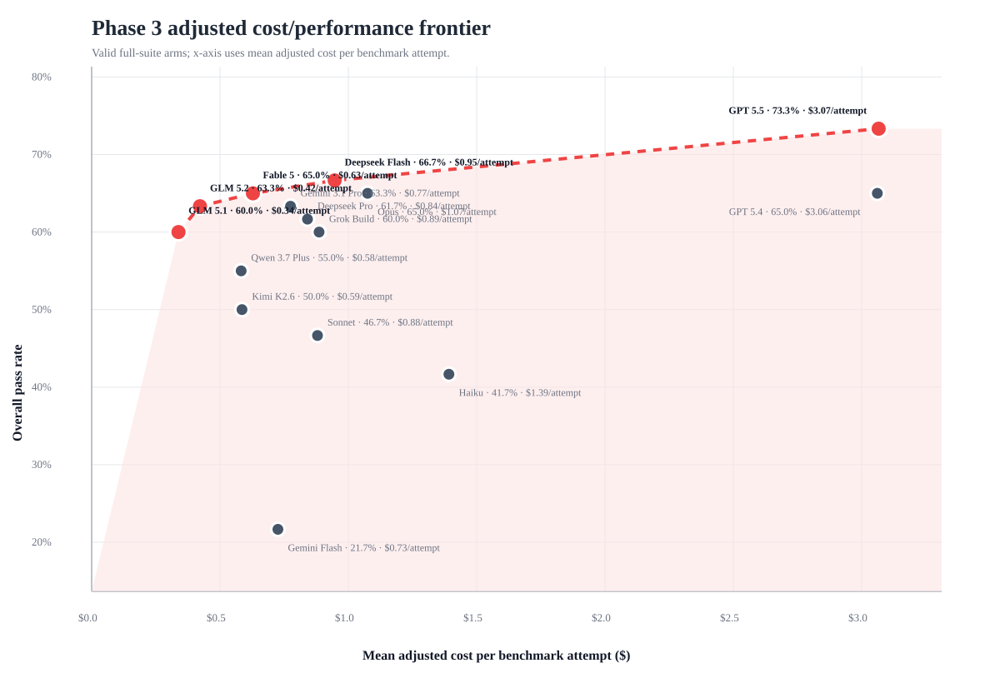

# Phase 3 sponsor summary: adjusted cost frontier (20260713)

## Executive summary

- Scope: 15 valid full-suite arms, 900 benchmark attempts, and 515 raw successes.
- Best raw pass rate: **router-gpt-5.5** at **73.3%**, with adjusted known cost of **$183.96**.
- Lowest cost per clean success among arms at or above 60% pass rate: **router-glm-5.1** at **$0.58** per clean success.
- Recorded cost was **$820.77**; adjusted known cost is **$972.17**, revealing a known accounting gap of **$151.40**.
- Failure/incomplete spend was **$335.76** (34.5% of adjusted known cost). Unclean spend was **$364.29** (37.5%).
- Failure/incomplete attempts consumed **213,482,015** input+output tokens (44.0%). Non-clean outcomes consumed **218,979,987** input+output tokens (45.1%).
- Remaining unresolved cost rows: **29**, all rows without usable cost or token metadata in the adjusted-cost layer.

## Cost/performance frontier

The Pareto frontier by pass rate versus mean adjusted cost per benchmark attempt is: **router-glm-5.1, router-glm-5.2, router-anthropic-fable-5, router-deepseek-flash, router-gpt-5.5**.
Because the full Terminal-Bench suite uses three attempts per task, the chart uses cost per benchmark attempt. Multiply by three for a rough three-attempt-per-task budget.

## Sponsor summary table

| Arm | Pass rate | Adjusted cost | Cost / clean success | Failure/incomplete spend | Unclean spend | Unclean token share | Confidence |
|---|---:|---:|---:|---:|---:|---:|---|
| router-gpt-5.5 | 73.3% | $183.96 | $4.38 | $41.64 (22.6%) | $47.93 (26.1%) | 24.9% | mixed |
| router-deepseek-flash | 66.7% | $56.80 | $1.42 | $13.88 (24.4%) | $13.88 (24.4%) | 61.8% | medium |
| router-anthropic-fable-5 | 65.0% | $37.69 | $1.02 | $7.33 (19.4%) | $17.38 (46.1%) | 22.5% | medium |
| router-anthropic-opus | 65.0% | $64.49 | $1.65 | $30.74 (47.7%) | $30.74 (47.7%) | 21.8% | mixed |
| router-gpt-5.4 | 65.0% | $183.65 | $4.83 | $34.49 (18.8%) | $39.60 (21.6%) | 20.1% | low |
| router-glm-5.2 | 63.3% | $25.32 | $0.72 | $6.87 (27.1%) | $8.23 (32.5%) | 57.5% | medium |
| router-gemini-3.1-pro | 63.3% | $46.47 | $1.29 | $13.82 (29.7%) | $14.46 (31.1%) | 25.3% | low |
| router-deepseek-pro | 61.7% | $50.44 | $1.36 | $12.29 (24.4%) | $12.29 (24.4%) | 26.8% | medium |
| router-glm-5.1 | 60.0% | $20.30 | $0.58 | $3.94 (19.4%) | $4.10 (20.2%) | 31.0% | mixed |
| router-grok-build-0.1 | 60.0% | $53.15 | $1.48 | $29.83 (56.1%) | $29.83 (56.1%) | 54.9% | mixed |
| router-qwen-3.7-plus | 55.0% | $34.94 | $1.09 | $16.47 (47.1%) | $19.16 (54.8%) | 53.2% | mixed |
| router-kimi-k2.6 | 50.0% | $35.13 | $1.17 | $22.07 (62.8%) | $22.07 (62.8%) | 56.2% | low |
| router-anthropic-sonnet | 46.7% | $52.79 | $1.89 | $23.32 (44.2%) | $23.32 (44.2%) | 40.4% | mixed |
| router-anthropic-haiku-sanitized | 41.7% | $83.51 | $3.34 | $54.82 (65.6%) | $54.82 (65.6%) | 65.7% | high |
| router-gemini-flash | 21.7% | $43.53 | $4.84 | $24.26 (55.7%) | $26.47 (60.8%) | 56.7% | mixed |

## Value-oriented shortlist

| Arm | Pass rate | Adjusted cost | Cost / clean success | Failure/incomplete spend | Unclean spend | Unclean token share | Confidence |
|---|---:|---:|---:|---:|---:|---:|---|
| router-glm-5.1 | 60.0% | $20.30 | $0.58 | $3.94 (19.4%) | $4.10 (20.2%) | 31.0% | mixed |
| router-glm-5.2 | 63.3% | $25.32 | $0.72 | $6.87 (27.1%) | $8.23 (32.5%) | 57.5% | medium |
| router-anthropic-fable-5 | 65.0% | $37.69 | $1.02 | $7.33 (19.4%) | $17.38 (46.1%) | 22.5% | medium |
| router-gemini-3.1-pro | 63.3% | $46.47 | $1.29 | $13.82 (29.7%) | $14.46 (31.1%) | 25.3% | low |
| router-deepseek-pro | 61.7% | $50.44 | $1.36 | $12.29 (24.4%) | $12.29 (24.4%) | 26.8% | medium |
| router-deepseek-flash | 66.7% | $56.80 | $1.42 | $13.88 (24.4%) | $13.88 (24.4%) | 61.8% | medium |
| router-grok-build-0.1 | 60.0% | $53.15 | $1.48 | $29.83 (56.1%) | $29.83 (56.1%) | 54.9% | mixed |
| router-anthropic-opus | 65.0% | $64.49 | $1.65 | $30.74 (47.7%) | $30.74 (47.7%) | 21.8% | mixed |

## Cost accounting and nonproductive spend

- The original recorded-cost view understated known spend by **$151.40**, or **18.4%** over recorded cost.
- The gap is concentrated in errored or operationally unclean paths, which is why adjusted cost is more appropriate for sponsor-facing cost comparisons.
- Failure/incomplete spend directly measures money spent on attempts that did not pass: **$335.76**.
- Unclean spend includes failures, incomplete outcomes, and exception-with-success-signal rows: **$364.29**.
- Token-volume waste is directionally similar: failure/incomplete attempts consumed **213,482,015** tokens; all non-clean outcomes consumed **218,979,987** tokens.

## Method note

- Recorded cost remains preserved as imported artifact truth.
- Adjusted known cost adds reconstructed missing-cost rows using configured pricing snapshots or same-arm empirical estimates.
- Invalid/quarantined runs are excluded from this valid-only comparison.
- Token-volume analysis uses input + output tokens. Cache tokens affect cost but are not added to the token-volume numerator to avoid double-counting cached input.
- Provider invoices/dashboards remain separate evidence; this report is a benchmark-level adjusted-cost view.

## Generated artifacts

- Frontier chart: `../../../results/phase3/reporting/phase3_adjusted_cost_frontier_20260713.svg`
- Sponsor summary table: `results/phase3/reporting/phase3_sponsor_summary_table_20260713.tsv`
- Token/outcome breakdown: `results/phase3/reporting/phase3_token_outcome_breakdown_20260713.tsv`

## Follow-up validation artifacts

Additional closeout artifacts were added after the initial sponsor summary:

- `PHASE3_CROSS_PHASE_COMPARISON_20260714.md` adds Phase 1 and Phase 2 to the Phase 3 comparison using an adjusted-cost layer for all phases.
- `PHASE3_CROSS_PHASE_TASK_AUDIT_20260714.md` verifies that Phase 1, Phase 2, and Phase 3 use the same 20-task suite and that every scored arm has 20 tasks × 3 attempts.
- `PHASE3_CLOSEOUT_INDEX_20260714.md` lists the final report, chart, cost accounting, and cross-phase artifacts.

